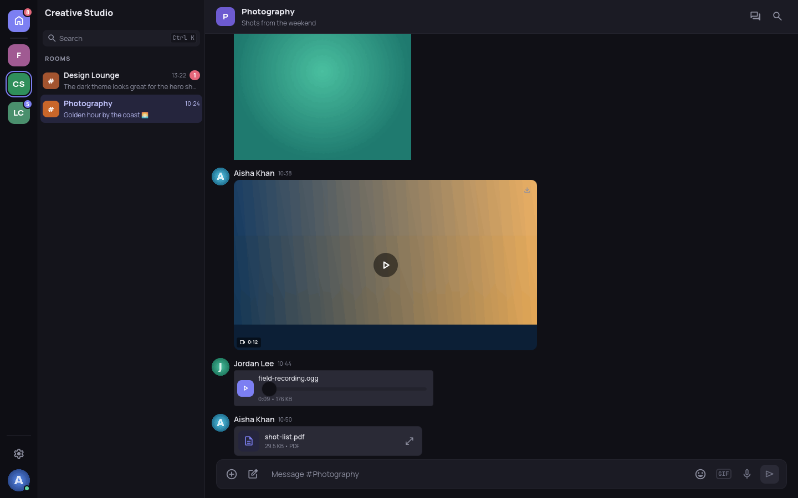
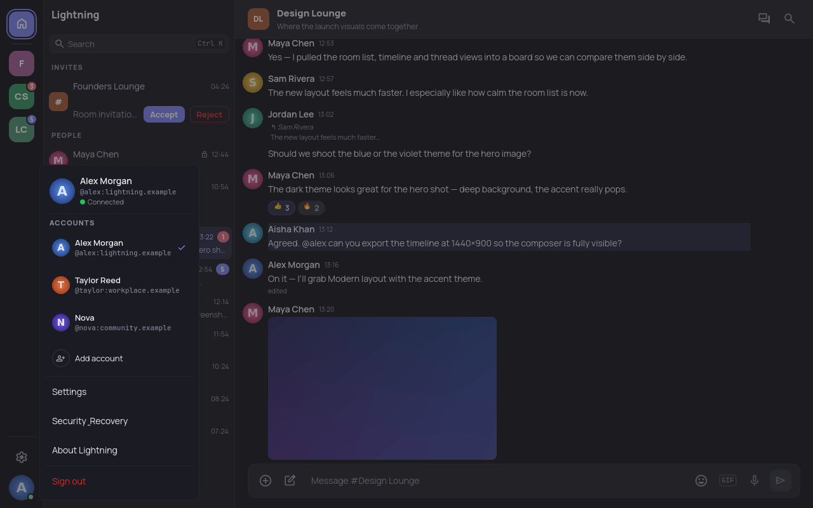
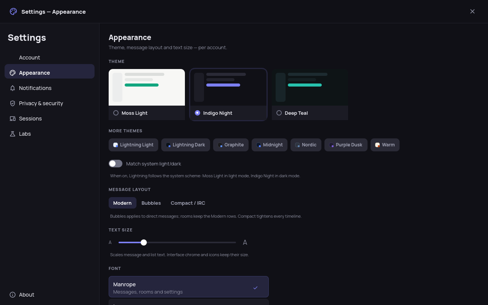
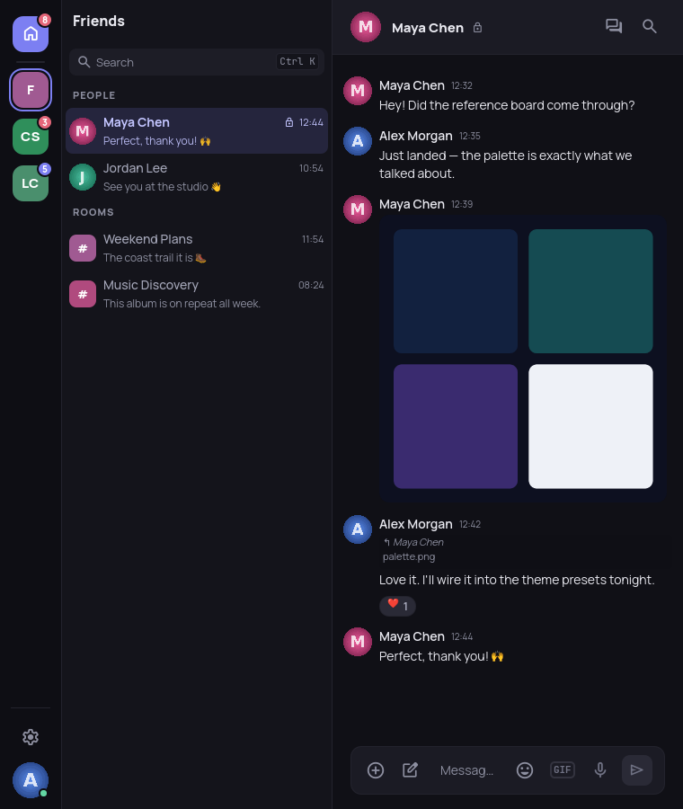

# Lightning

**A fast, native Matrix desktop client built with Qt and the official Rust Matrix SDK.**

Lightning is a Linux-first desktop [Matrix](https://matrix.org/) client. The
interface is written in Qt 6 / QML with C++ for the application layer, and the
official [`matrix-rust-sdk`](https://github.com/matrix-org/matrix-rust-sdk)
provides synchronisation, timelines, end-to-end encryption, threads, and media.

> **Status:** under active development (0.6.x). It is usable day-to-day but not
> formally audited or certified — expect rough edges and occasional regressions.

[](LICENSE)
[](https://gitlab.smetonis.net/Mizerd/lightning/-/releases)
[](https://www.qt.io/)
[](https://github.com/matrix-org/matrix-rust-sdk)
[](https://www.kernel.org/)


<p align="center">
  
</p>

> The screenshots on this page are taken from Lightning's development-only
> [screenshot-demo mode](#screenshot-demo-mode) and show fictional `*.example`
> accounts and locally generated media — not real conversations.

## Contents

- [Overview](#overview)
- [Features](#features)
- [Screenshots](#screenshots)
- [Installation](#installation)
- [Building from source](#building-from-source)
- [Screenshot-demo mode](#screenshot-demo-mode)
- [Architecture](#architecture)
- [Security and privacy](#security-and-privacy)
- [Project status](#project-status)
- [Development and testing](#development-and-testing)
- [Contributing](#contributing)
- [Packaging and releases](#packaging-and-releases)
- [Licence](#licence)

## Overview

Lightning aims to be a responsive, native desktop Matrix experience rather than
a web view: a four-pane shell (Spaces rail, room list, timeline, side panel),
SDK-backed encryption, modern room and thread workflows, efficient timeline
navigation, and native desktop integration — all under an open-source licence.

Matrix behaviour (login, sync, timelines, E2EE, media) is owned entirely by the
official Rust Matrix SDK; Lightning does not implement its own Matrix
cryptography.

## Features

Everything below is implemented in the current codebase. Because Lightning is
still developing, some workflows remain experimental.

### Accounts, rooms and Spaces

- Password login, persistent sessions and restoration, and logout
- **Multi-account**: several signed-in accounts across any mix of homeservers,
  with fast in-app switching and no login form between them; each account keeps
  its own isolated SDK and encryption store, and only the active account syncs
- Scoped account removal and logout that never touch other accounts
- Joined rooms, direct messages, invites, and Matrix Space hierarchy navigation
- Room creation, member lists and roles, room-profile editing, and invites
- Keyboard quick-switch (Ctrl-K) across rooms, DMs, Spaces, and invites, plus
  search across the currently loaded timeline

### Messaging and timelines

- Live timelines with replies, edits, reactions, redactions, mentions, typing
  indicators, and read receipts
- **MSC3381 polls** — vote, change your vote, and see live tallies
- Unread and mention states, marked-unread, first-unread and jump-to-latest
  navigation, and backward pagination
- Member profile popovers and room-details panel
- Smooth mouse-wheel and touchpad scrolling with per-room position preservation

### Threads

- SDK-backed Matrix thread timelines, replies, and threaded read receipts
- Per-room Threads view, a dedicated thread panel, follow/unfollow, and pagination
- Compact Element-style thread summary cards on room-timeline roots
- Text, image, and file attachments in threads, including encrypted rooms

### Media

- Images, files, and clipboard images, including encrypted attachments
- Inline **video and audio playback** with posters, duration, and waveforms
- Animated GIF attachments and a multi-provider GIF browser (GIPHY and KLIPY):
  trending, search, categories, favourites, recents, safe-search, and autoplay
  policy, sending as real Matrix media into rooms and threads
- Client-side link previews with encrypted-room privacy controls
- Image viewer with save, and validated inline rendering of direct raster links

### Encryption and account security

- Encrypted send/receive through the Rust Matrix SDK, with automatic key
  handling, late in-place decryption, and manual retry
- SAS emoji device verification and read-only session-trust information
- Secure Backup recovery-key or passphrase restore and encrypted room-key import
- Crypto health, recovery, and diagnostics controls in Settings

### Desktop experience and personalization

- Ten complete, WCAG-AA-tested semantic themes — Moss Light, Indigo Night, Deep
  Teal (the design-handoff set that *System* follows), plus Lightning Light/Dark,
  Graphite, Midnight, Nordic, Purple Dusk, and Warm — persistent and
  live-switching, with a message-layout selector and text-size scaling (all
  per-account)
- Bundled Manrope and JetBrains Mono fonts and five selectable UI fonts
- Native freedesktop notifications with mentions, per-room modes, active-room
  suppression, privacy modes, and sounds
- Responsive layouts from narrow to wide, a local Unicode emoji picker, an
  installed application icon and desktop entry, and accessible keyboard navigation

## Screenshots

<table>
  <tr>
    <td width="50%">
      <br>
      <sub><b>Media</b> — images, video posters, audio and files render inline.</sub>
    </td>
    <td width="50%">
      <br>
      <sub><b>Threads</b> — a dedicated thread panel beside the room.</sub>
    </td>
  </tr>
  <tr>
    <td width="50%">
      <br>
      <sub><b>Multi-account</b> — switch signed-in accounts in place.</sub>
    </td>
    <td width="50%">
      <br>
      <sub><b>Settings</b> — themes, message layout, and text size.</sub>
    </td>
  </tr>
</table>

<p align="center">
  <br>
  <sub><b>Responsive</b> — the layout adapts down to narrow desktop windows.</sub>
</p>

## Installation

Prebuilt packages are attached to the project's
[**Releases**](https://gitlab.smetonis.net/Mizerd/lightning/-/releases) page and
published to its GitLab Package Registry.

- **Linux** (primary platform): `.deb`, `.rpm`, Flatpak, AppImage, and Snap.
- **Windows** (x86-64, available since v0.6.3): a portable `.zip`, an `.msi`
  installer, and a `-setup.exe` installer. These packages are currently
  **unsigned**, so Windows may show an "unknown publisher" / SmartScreen warning.
- **macOS** is not currently supported.

The authoritative per-release list of artifacts is the release notes — for
example [`docs/releases/v0.6.4.md`](docs/releases/v0.6.4.md) — and the Releases
page itself. Packaging, cross-platform builds, publishing, and verification are
maintained in a separate automation project,
[**lightning-deploy**](https://gitlab.smetonis.net/Mizerd/lightning-deploy); this
repository holds only the application source. If no package is available for your
platform, build from source (below).

## Building from source

The verified development workflow uses the repository's Nix flake on Linux, with
Qt 6.5+ and a Rust toolchain (Rust 2021 edition) provided by the dev shell.

```sh
git clone https://gitlab.smetonis.net/Mizerd/lightning.git
cd lightning
nix develop
```

**Production build** — the Rust SDK backend (real Matrix, E2EE, threads):

```sh
nix develop -c cmake -S . -B build-rust -G Ninja -DENABLE_RUST_SDK_BACKEND=ON
nix develop -c cmake --build build-rust
nix develop -c ./build-rust/matrix-client --backend=rust
```

**Developer build** — a lighter tree with the in-memory mock/experimental HTTP
backends, for UI work and tests without a homeserver:

```sh
nix develop -c cmake -S . -B build -G Ninja
nix develop -c cmake --build build
```

The Rust backend is required for real Matrix, encryption, and thread features.
Release binaries are Rust-only (`-DLIGHTNING_RUST_ONLY=ON`); the mock and HTTP
backends are development-only and are compiled out of release builds.

See [`docs/build-and-test.md`](docs/build-and-test.md) for the full details.

## Screenshot-demo mode

A development-only mode boots the **real** UI on the in-memory mock backend with
three fictional accounts, locally generated media, and deterministic scenarios —
no network, no Matrix credentials, no real stores. It is how the screenshots on
this page were produced, and it is impossible to reach in a shipped binary.

```sh
scripts/run-screenshot-demo.sh --scenario main-chat --theme midnight \
  --size 1440x900 --hide-controls
```

See [`docs/screenshot-demo.md`](docs/screenshot-demo.md) for accounts, scenarios,
window presets, and the full option list.

## Architecture

Lightning keeps presentation, application state, and Matrix behaviour separate:

```text
Qt 6 / QML  ──  visual presentation, interaction, theming, layout
     │
C++         ──  application state, Qt-facing models/controllers, lifecycle,
     │          account/room/thread isolation, navigation, notification policy
Rust bridge ──  FFI to…
     │
matrix-rust-sdk  ──  login/sync, timelines, threads, event cache, media,
                     Olm/Megolm E2EE, verification, key backup, receipts
```

- **QML** owns presentation and interaction only — never protocol, credentials,
  crypto, or persistence.
- **C++** owns the safe Qt-facing boundary and application state.
- The **official Rust Matrix SDK** owns all Matrix protocol and cryptography.
- The development-only mock and screenshot-demo backends are compiled out of
  release builds. See [`docs/architecture.md`](docs/architecture.md).

## Security and privacy

- End-to-end encryption is handled entirely by the official Rust Matrix SDK;
  Lightning implements no custom Matrix cryptography.
- Encrypted-room plaintext is kept in memory only and is not written to
  application caches; cryptographic material, tokens, recovery keys, and message
  bodies are never logged.
- Access tokens are stored in the OS secret service (libsecret / Windows
  Credential Manager) where available, with a clearly-flagged insecure fallback.
- The screenshot-demo mode never touches real accounts, stores, libsecret, or the
  network, and cannot exist in a release binary.

Lightning has **not** been formally security audited. Security-sensitive changes —
especially anything touching E2EE — require careful review, explicit reasoning,
and tests. See [`docs/threat-model.md`](docs/threat-model.md).

## Project status

Lightning is under active development. Linux is the primary development and
support target; official Windows (x86-64) packages are published as of v0.6.3.
APIs, UI, and behaviour may change, some features are experimental (for example,
voice-message *recording* is not yet implemented, and message search covers the
loaded timeline rather than the full server-side history), and Matrix
interoperability should be verified rather than assumed. It should not be treated
as a finished or certified product.

## Development and testing

```sh
# Rust SDK tests
nix develop -c cargo test --manifest-path rust/Cargo.toml

# C++/QML/controller tests for a built tree (build the tree first)
nix develop -c ctest --test-dir build-rust --output-on-failure
nix develop -c ctest --test-dir build       --output-on-failure
```

Compilation and launch are not feature validation; live Matrix behaviour
(interoperability, decryption, notifications, physical scrolling) must be tested
on a real homeserver and reported honestly. See
[`docs/build-and-test.md`](docs/build-and-test.md).

## Contributing

Issues, focused merge requests, testing, and bug reports are welcome. Please:

- keep commits scoped and coherent, and run the relevant tests;
- keep security- and crypto-related changes especially focused, with explicit
  reasoning and tests;
- never commit credentials, provider keys, private stores, or real conversations.

The source is publicly readable under GPL-3.0-or-later. Direct write access to
the canonical repository is currently limited to the maintainer, and public
registration, forks, or merge-request submission may not be enabled on this
GitLab instance — contact the maintainer for access. `CLAUDE.md` documents the
repository's operating conventions (primarily for coding agents).

## Packaging and releases

This repository contains the Lightning **application source**. Packaging,
cross-platform package builds, release publishing, and artifact verification are
maintained separately in
[**lightning-deploy**](https://gitlab.smetonis.net/Mizerd/lightning-deploy).
Official packages are still published under this main Lightning project's Package
Registry and attached to its
[Releases](https://gitlab.smetonis.net/Mizerd/lightning/-/releases);
`lightning-deploy` holds only the pipeline and automation logic. Releases are
package-first: the tag and GitLab Release are created only after the packages are
built, validated on a clean system, published, and verified.

## Licence

Copyright © 2026 Rokas Smetonis.

Lightning is free software licensed under the GNU General Public License v3.0 or
later. See [LICENSE](LICENSE).

---

**Maintainer:** Rokas Smetonis — [antrasrokas@gmail.com](mailto:antrasrokas@gmail.com)
· Public source: <https://gitlab.smetonis.net/Mizerd/lightning>
