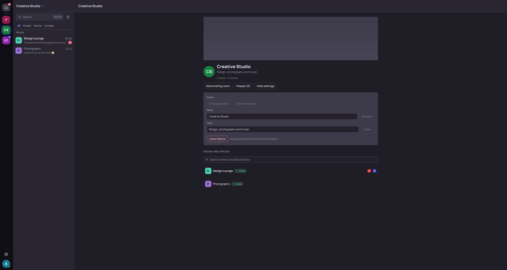

<div align="center">


# ⚡ Lightning

**A fast, native Matrix desktop client — Qt 6 on top of the official Rust Matrix SDK.**

[](LICENSE)
[](https://gitlab.smetonis.net/Mizerd/lightning/-/releases)
[](#installation)
[](https://www.qt.io/)
[](https://github.com/matrix-org/matrix-rust-sdk)


</div>

Lightning is a desktop [Matrix](https://matrix.org/) client for **Linux,
Windows and macOS**. The interface is Qt 6 / QML with C++ for the application layer, and
the official [`matrix-rust-sdk`](https://github.com/matrix-org/matrix-rust-sdk)
owns synchronisation, timelines, end-to-end encryption, threads, and media —
Lightning implements no Matrix cryptography of its own.

|  |  |
|---|---|
| **Native, not a web view** | Qt 6 / QML shell with a four-pane layout, eleven WCAG-AA themes, and an editor for your own |
| **Real E2EE** | SDK-owned Olm/Megolm, cross-signing, SAS **and** QR verification, key backup |
| **Threads that work** | SDK thread timelines, a dedicated panel, summary cards, threaded receipts |
| **Multi-account** | Several homeservers at once, isolated stores, in-place switching |
| **Rich composer** | Markdown, mentions, polls, GIFs, emoji, attachments — in rooms and threads |
| **Ten languages** | Qt-native translation, including right-to-left Arabic |
| **Open source** | GPL-3.0-or-later, packaged for Linux, Windows and macOS |

> **Status:** under active development (0.7.x). Usable day to day, but not
> formally audited or certified — expect rough edges and occasional
> regressions. Linux is the primary development and support target; Windows
> (x86-64) packages ship alongside every release from v0.6.3 onward, and
> **macOS (Apple Silicon, macOS 26+) from v0.7.5** — unsigned, so it takes one
> trip through System Settings to open. See [macOS](#macos-apple-silicon-macos-26-or-newer).

## Contents

- [Quick start](#quick-start)
- [Features](#features)
- [Screenshots](#screenshots)
- [Installation](#installation)
- [Building from source](#building-from-source)
- [Screenshot-demo mode](#screenshot-demo-mode)
- [Architecture](#architecture)
- [Security and privacy](#security-and-privacy)
- [Project status](#project-status)
- [Development and testing](#development-and-testing)
- [Contributing](#contributing)
- [Packaging and releases](#packaging-and-releases)
- [Licence](#licence)

## Quick start

Download a package from the
[**Releases**](https://gitlab.smetonis.net/Mizerd/lightning/-/releases) page
(or the [GitHub mirror](https://github.com/Mizerd/lightning/releases)) and
install it:

```sh
sudo apt install ./lightning_0.7.6_amd64.deb          # Debian / Ubuntu
sudo dnf install ./lightning-0.7.6-1.x86_64.rpm       # Fedora / RHEL
chmod +x Lightning-0.7.6-x86_64.AppImage && ./Lightning-0.7.6-x86_64.AppImage
```

On **Windows**, run the `.msi` or `-setup.exe` installer, or extract the
portable `.zip` and run `Lightning.exe`. Every format is per-user and needs no
administrator rights.

See [Installation](#installation) for every package format, checksum
verification and uninstall instructions, or
[Building from source](#building-from-source) to compile it yourself.

## Features

Everything below is implemented in the current codebase. Because Lightning is
still developing, some workflows remain experimental.

### What you will not find in most Matrix clients

- **A real GIF browser, not a link box.** Two providers side by side — GIPHY
  and KLIPY — with trending, search, categories, recents, safe-search and an
  autoplay policy. Everything sends as genuine Matrix media, encrypted like any
  other attachment. **Saved GIFs** are one star with one destination: star a
  provider tile *or* a GIF already in a chat and it lands in the picker's
  **Saved** tab. Provider GIFs are saved as links; one saved out of a chat is
  copied to your device into an account-scoped store, bounded at 200 items /
  64 MiB, deleted on sign-out and disclosed in Settings. Only your search term
  ever reaches a provider — never a Matrix ID, room, or message body.
- **Voice messages with a live waveform** (MSC3245) — record, watch the level
  as you speak, send to a room *or* a thread as mono Opus through the SDK's
  encrypting media path.
- **Multi-account across different homeservers at once**, switching in place
  with no login form in between. Every account keeps its own isolated SDK and
  encryption store, and only the active one syncs.
- **It updates itself, and verifies first.** An Ed25519-signed manifest decides
  the exact filename, size and SHA-256; the signature is checked over the raw
  bytes before a single field is read, and a failed check is terminal — there
  is no "install anyway". The manifest names a file and can never name a
  command.
- **Eleven complete themes, every one WCAG-AA checked**, led by the Storm brand
  theme — with five bundled UI fonts, a message-layout selector and text-size
  scaling, all per-account. And **a real theme editor**: click any part of a
  live sample window, or a role in the list, and recolour it. Keep as many
  themes as you like, name them, and **share one as a block of text** anybody
  can paste back in.
- **Ten languages**, translated in full and switchable without a restart:
  English, Arabic, Bengali, Chinese (Simplified), French, Hindi, Indonesian,
  Portuguese, Russian and Spanish — plurals included, which is why "1 room" and
  Arabic's six-form plural both read correctly instead of shipping "%n
  room(s)".
- **Native, not a web view.** Qt 6 / QML with a four-pane layout, and the
  official Rust Matrix SDK owning sync, timelines, E2EE, threads and media.
  Lightning implements no Matrix cryptography of its own.

### Accounts, rooms and Spaces

- **Browser sign-in (OAuth 2.0 / OIDC)** where the homeserver offers it,
  live-validated against matrix.org including new-account registration through
  an upstream identity provider. Lightning asks the server which methods it
  actually supports as you type and offers only those. The flow is SDK-owned
  (`Client::oauth()`); Lightning adds only the browser launch and a single-shot
  loopback listener. Sign-in runs in two phases so a device the server just
  created can never attach to another device's encryption store. Legacy Matrix
  SSO is detected and reported as unsupported rather than offered as a button
  that cannot work
- Password login, persistent sessions and restoration, scoped logout and
  account removal that never touch another account
- Joined rooms, DMs, invites, and Matrix Space hierarchy — including **nested
  subspaces**, indented in the rail and drillable from a Space's front page
- **Space front page**: one unified *Rooms and spaces* list where joined rooms,
  joined subspaces and rooms you have not joined yet sit together, each stating
  its own membership, with select-and-remove, a *Suggested* toggle, invites, and
  in-place editing of the Space's name, topic and avatar where your power level
  allows
- **Rail**: click a Space to open its overview; the chevron expands its most
  active rooms inline. **Drag it into the order you want**, and group Spaces
  into **folders** — a folder that is collapsed still carries the unread count
  of everything inside it, so filing something away never hides it
- **Profile banners** (MSC4427 over MSC4133) — a wide image behind a profile
  card, read and written under **both** the standard field name and the one
  Commet already ships, so a banner set in Lightning shows up there and the
  other way round. Requires a homeserver with extended profile fields; where
  there isn't one, Lightning says so instead of failing an upload
- **Space banners** — a real image on a Space's front page, set by whoever the
  Space's own power levels allow. Matrix specifies no room banner, so Lightning
  writes the one **Sable** already uses, and a banner set in either shows up in
  the other. Shown cropped to a fixed strip by default, with corner controls to
  **expand** it to the whole picture or **hide** banners entirely — a view
  choice, so it needs no permission and applies everywhere at once
- **Discover and join** — browse or search the public directory, or paste a
  room address, `matrix:` URI or matrix.to link and join from the preview.
  **Knock** on rooms that require it, and withdraw a pending knock from the
  room list. Refusals say what they actually were — banned, invite-only, or
  restricted to another space
- **Upgraded rooms** — a tombstoned room shows a banner offering the successor
  instead of moving you; nothing joins, leaves or navigates unless you press it
- **Moderation and roles** — kick, ban, unban, and change a member's real
  `m.room.power_levels` value, each gated by what Matrix would actually allow.
  A room's custom numbers are never rounded into a preset: a member at 42 reads
  as "Custom (42)" and stays there
- **Room access** — who can join, and the room's published address, both gated
  by the room's own required level. A space-restricted room is shown honestly
  and left alone
- **Presence** — online / away / offline dots on 1:1 DM rows, the People list
  and profile popovers. Sliding Sync carries no presence events, so this polls
  only the users on screen; an unknown state renders **nothing** rather than a
  made-up "offline". Your own is behind a Privacy setting (default on)
- **Ignore and report** — account-wide `m.ignored_user_list` ignores that
  follow you to every client, and message reports to the room's admins
- Room list filters (All / People / Rooms / Unreads), persisted per account
- Quick switcher (Ctrl-K) with navigate and command (`>`) modes, plus
  find-in-timeline (Ctrl-F) that highlights every match

### Messaging and timelines

- Live timelines with replies, edits, reactions, redactions, mentions and
  typing indicators
- **`@room`** — mention everyone at once. Offered only where the room's own
  power level for a whole-room notification actually permits it, and sent as a
  real `m.mentions.room` so other clients notify for it properly
- **Drop a file in and press Enter** — the composer takes focus on the drop, so
  a drag-and-drop send never needs a click first
- **Read receipts** as Element-style avatar chips on a right-edge rail, with an
  overflow pill — **click them** for the reader list with names, avatars and the
  time each person read
- **Pinned messages** (`m.room.pinned_events`) — pin and unpin where power
  levels allow, read them from a Pinned tab, and jump to the original through
  the same navigation replies use. A deleted or unreachable pin says so instead
  of landing you somewhere unrelated
- **Message search** — room panel with filters plus global search
  (Ctrl-Shift-F). Unencrypted rooms use the homeserver's own search over full
  history; **in an encrypted room the server cannot search ciphertext**, so
  Lightning searches the loaded timeline and says so rather than quietly
  returning less. Only your search term is sent
- **Forward a message** to another room — text, images, video, audio, voice,
  files. Media is re-uploaded rather than mxc-copied, so the target room can
  actually fetch it and no per-event key is planted in a room that never
  negotiated one
- **Drafts** survive switching rooms. Unencrypted rooms keep them between
  restarts; an **encrypted** room holds them in memory only, and unknown
  encryption state is treated as encrypted
- **MSC3381 polls**, per-user deterministic name colours, replies to images
  showing a thumbnail (in the quote *and* while you type), and **Copy image**
  straight to the clipboard
- **Right-click an image** for copy, save, forward, reply and open — in the
  timeline and full screen — and **double-click anyone** to open their profile
- A run of deleted messages **collapses into one line** instead of leaving a
  column of tombstones
- Images and videos **show a preview before you send them**, including one
  pasted from the clipboard
- Unread and mention states, marked-unread, first-unread and jump-to-latest
  navigation, backward pagination, and "Mark as read" from the room list for
  any room
- Smooth mouse-wheel and touchpad scrolling with per-room position
  preservation, and a reading position that survives history loading

### Threads

- SDK-backed Matrix thread timelines, replies and threaded read receipts
- Per-room Threads view, dedicated panel, follow/unfollow, pagination
- Element-style summary cards with participant facepiles on timeline roots
- Text, image, file and **voice** attachments in threads, including encrypted
  rooms

### Media

- Images, files and clipboard images, including encrypted attachments
- Inline **video and audio playback** with posters, duration and waveforms;
  outgoing videos carry a locally extracted poster. One shared volume control
  governs every player, audio shows embedded cover art, and poster extraction
  runs off the UI thread
- Room Information **Media and Files** tabs, with thumbnails loaded lazily
- Animated GIF attachments, client-side link previews with encrypted-room
  privacy controls, an image viewer with save, and validated inline rendering
  of direct raster links

### Encryption and account security

- Encrypted send/receive through the Rust Matrix SDK, with automatic key
  handling, late in-place decryption and manual retry
- **SAS emoji verification in both directions** and **QR verification**, run in
  a focused centred dialog — the emoji you are comparing are never buried at
  the bottom of a scrolled page — which also handles a verification another
  client starts
- **Unverified-session prompts you can turn off.** "Stop reminding me" silences
  the badges for that account; it never claims the session is verified, the
  Sessions page keeps stating the fact, and the reminder returns by itself for a
  later unverified session
- Secure Backup recovery-key or passphrase restore, encrypted room-key import,
  and per-device sign-out (OAuth accounts are sent to their account console
  rather than shown a password prompt that cannot work)
- Crypto health and recovery controls, plus a sanitized support-diagnostics
  export (hashed identifiers, no paths, no tokens)

### Desktop experience and personalization

- The **Storm design language** across the whole menu system: context menus
  with keycap accelerators and a quick-reaction strip, a per-room notifications
  flyout, redesigned pickers and mention popup, identity cards in the account
  switcher, and dialogs in one shared visual language
- Searchable full-view Settings; bundled Manrope, JetBrains Mono and Space
  Grotesk fonts; letter-initial fallback avatars for rooms and Spaces
- Native freedesktop notifications with mentions, active-room suppression,
  privacy modes, sounds and the sender's avatar. **Per-room modes** are written
  to your account's server push rules, so a muted room stays muted on your
  other clients
- **Every panel resizes and hides.** Drag the room list and the right-hand
  panel to the width you want; hide the Spaces rail and the room list entirely
  when you want the conversation and nothing else. Widths persist per account
- **Close to the system tray** rather than quitting, with an unread count in
  the tooltip, and optionally start there
- Fallback room and user discs are **coloured from the theme you are using**,
  so a cool window stops showing warm initials — nine slots wide enough apart
  that two rooms never look alike, each with initials at 4.5:1
- One tuned scrolling feel in every pane, resizable pickers pinned to the
  composer with a remembered size, responsive narrow-to-wide layouts, a local
  Unicode emoji picker, and accessible keyboard navigation throughout

### Updating

- Settings → Updates checks for a new release and, where the package type
  allows, installs it: MSI and Setup EXE through their own installers,
  portable ZIP and AppImage replaced transactionally with rollback, DEB and RPM
  handed to your package manager through PolicyKit. Flatpak and Snap are left
  to their own ecosystems, and a development build never installs anything
- New versions announce themselves with a corner card and a badge on the
  settings cog, dismissible per version
- Binaries download from the read-only GitHub mirror first (falling back to
  GitLab) purely to save bandwidth. GitLab stays the release authority:
  Lightning makes no GitHub API call and reads no GitHub metadata, so a
  compromised mirror can break a download but cannot ship an update
- Automatic checks are **on by default** and can be turned off. A check sends
  only `Lightning/<version>` — no Matrix ID, homeserver, device ID, token, room
  data or analytics identifier, and no tracking ID is generated at all. See
  [Application updates](docs/updates.md)

## Screenshots

<table>
  <tr>
    <td width="50%">
      <br>
      <sub><b>Rooms</b> — replies, reactions, edits, an inline image and a pending invite.</sub>
    </td>
    <td width="50%">
      <br>
      <sub><b>Theme editor</b> — click any part of the sample window to recolour it.</sub>
    </td>
  </tr>
  <tr>
    <td width="50%">
      <br>
      <sub><b>Emoji</b> — categories, search and skin tones, in an encrypted DM.</sub>
    </td>
    <td width="50%">
      <br>
      <sub><b>Polls and voice</b> — vote inline; record with a live waveform.</sub>
    </td>
  </tr>
  <tr>
    <td width="50%">
      <br>
      <sub><b>Spaces</b> — one list of rooms and subspaces, with in-place settings.</sub>
    </td>
    <td width="50%">
      <br>
      <sub><b>Threads</b> — a dedicated panel beside the room, with summary cards inline.</sub>
    </td>
  </tr>
</table>

> Every screenshot comes from Lightning's development-only
> [screenshot-demo mode](#screenshot-demo-mode): fictional `*.example` accounts
> and locally generated media, never real conversations.

## Installation

Prebuilt packages are attached to the project's
[**Releases**](https://gitlab.smetonis.net/Mizerd/lightning/-/releases) page and
mirrored to
[GitHub Releases](https://github.com/Mizerd/lightning/releases). Download the
file for your system, then follow the matching section below. Every release also
ships a `SHA256SUMS` file — verifying is one command and is worth doing, because
no package is code-signed yet:

```sh
sha256sum -c SHA256SUMS --ignore-missing
```

Replace `0.7.6` in the commands below with the version you downloaded.

### Debian, Ubuntu, Linux Mint, Pop!_OS (`.deb`)

```sh
sudo apt install ./lightning_0.7.6_amd64.deb
```

`apt` resolves the dependencies itself; the leading `./` is required, otherwise
apt looks for a package by that name in your repositories. To remove it:

```sh
sudo apt remove lightning
```

### Fedora, RHEL, openSUSE (`.rpm`)

```sh
sudo dnf install ./lightning-0.7.6-1.x86_64.rpm     # Fedora / RHEL
sudo zypper install ./lightning-0.7.6-1.x86_64.rpm  # openSUSE
```

To remove it: `sudo dnf remove lightning`.

### AppImage (any distribution, no installation)

```sh
chmod +x Lightning-0.7.6-x86_64.AppImage
./Lightning-0.7.6-x86_64.AppImage
```

Nothing is installed and nothing is written outside your user profile; delete
the file to remove it. If it will not start, your system may need FUSE
(`sudo apt install libfuse2` on Debian/Ubuntu), or you can run it with
`--appimage-extract-and-run`.

### Flatpak

```sh
# The runtime, once (skipped automatically if you already have it)
flatpak remote-add --if-not-exists --user flathub https://flathub.org/repo/flathub.flatpakrepo
flatpak install --user flathub org.kde.Platform//6.9

flatpak install --user ./lightning_0.7.6_amd64.flatpak
flatpak run net.smetonis.Lightning
```

To remove it: `flatpak uninstall --user net.smetonis.Lightning`.

### Snap

The snap is not published to the Snap Store, so it installs as a local file and
needs `--dangerous` — that flag means "this file is not signed by the store",
not that the snap is unsafe. It is built with `strict` confinement:

```sh
sudo snap install --dangerous ./lightning_0.7.6_amd64.snap
```

To remove it: `sudo snap remove lightning`.

### Windows (x86-64, Windows 10 or later)

Three formats, all per-user — **none of them needs administrator rights**, and
none modifies `PATH`, file associations, URL protocols, services, scheduled
tasks, firewall rules, or autostart.

| Format | Install | Uninstall |
|---|---|---|
| **MSI** | Double-click, or `msiexec /i Lightning-0.7.6-<sha>-windows-x86_64.msi` | Settings → Apps → Installed apps, or `msiexec /x` |
| **Setup EXE** | Run `Lightning-0.7.6-<sha>-windows-x86_64-setup.exe` | Settings → Apps → Installed apps, or the **Uninstall Lightning** shortcut |
| **Portable ZIP** | Extract anywhere, run `Lightning.exe` | Delete the folder |

MSI and Setup EXE install to `%LOCALAPPDATA%\Programs\Lightning` with a
Start-menu shortcut. The portable ZIP installs nothing and writes no registry
keys.

**Windows packages are not code-signed**, so Windows will show an "unknown
publisher" / SmartScreen warning — choose *More info → Run anyway* if you are
satisfied the checksum matches. Code signing through
[SignPath Foundation](https://signpath.org/) is *planned*: it has not been
applied for, granted, or activated, and no Lightning release is signed today.
See the [**Code signing policy**](docs/code-signing-policy.md) and
[`docs/windows-signing-inventory.md`](docs/windows-signing-inventory.md).

To verify a download on Windows:

```powershell
Get-FileHash .\Lightning-0.7.6-<sha>-windows-x86_64.msi -Algorithm SHA256
```

### macOS (Apple Silicon, macOS 26 or newer)

Published from v0.7.5 onward; the current build is
`Lightning-0.7.6-<sha>-macos-arm64.zip`.

**Two hard limits, both worth checking before you download:**

- **Apple Silicon only** (M1 and later). There is no Intel build — the Qt
  distribution the bundle is built against is arm64-only.
- **macOS 26 or newer.** The minimum is derived from the Qt frameworks the app
  links, not chosen; on macOS 15 or earlier it will not launch.

Unzip it and drag **Lightning.app** into `/Applications`.

#### Opening it the first time (Gatekeeper)

The app is **not signed with an Apple Developer ID and not notarized**, so the
first time you open it macOS will refuse and say Apple cannot verify it. That is
expected, and it is not a claim that anything is wrong with the file — it means
nobody has paid Apple to vouch for it. Get the file from the
[Releases](https://github.com/Mizerd/lightning/releases) page and nowhere else,
then:

1. **Double-click Lightning.app and let macOS refuse.** This step is not
   filler — the button in step 3 only appears after macOS has blocked the app
   at least once.
2. Open **System Settings → Privacy & Security** and scroll to **Security**.
3. Next to *"Lightning" was blocked to protect your Mac*, click **Open Anyway**.
4. Confirm with **Open Anyway**, and authenticate with Touch ID or your
   password.

macOS remembers the decision; you only do this once per installed copy.

> On macOS 14 and earlier the old Control-click → **Open** shortcut also works.
> Apple removed it in macOS 15, and this build needs macOS 26 anyway, so
> **Open Anyway** is the route.

If you would rather clear the quarantine flag directly, this does the same
thing without the System Settings trip:

```sh
xattr -dr com.apple.quarantine /Applications/Lightning.app
```

#### What the macOS build does not do

- **It does not update itself.** Lightning will tell you a new version exists,
  but installing it means downloading the next zip — the in-app installer has
  no macOS path, so it does not pretend to.
- **It has had no GUI testing on macOS.** The pipeline proves the bundle's
  frameworks load and the binary runs; nobody has clicked through it on a Mac.
  Please report what you find.
- Signing and notarization are the next step; until then the Gatekeeper trip
  above is the cost.

### Notes

Uninstalling removes the application and its shortcuts and deliberately leaves
your Matrix session, settings, and message stores alone — those live in your
user profile, outside the install directory, and are removed by signing out of
the account inside the app.

Once installed, Lightning can update itself: see
[Application updates](docs/updates.md). The authoritative per-release list of
artifacts is the release notes — for example
[`docs/releases/v0.7.6.md`](docs/releases/v0.7.6.md) — and the Releases page
itself. Packaging, cross-platform builds, publishing, and verification are
maintained in a separate automation project,
[**lightning-deploy**](https://gitlab.smetonis.net/Mizerd/lightning-deploy); this
repository holds only the application source. If no package is available for
your platform, build from source (below).

## Building from source

The verified development workflow uses the repository's Nix flake on Linux, with
Qt 6.5+ and a Rust toolchain (Rust 2021 edition) provided by the dev shell.

```sh
git clone https://gitlab.smetonis.net/Mizerd/lightning.git
cd lightning
nix develop
```

**Production build** — the Rust SDK backend (real Matrix, E2EE, threads):

```sh
nix develop -c cmake -S . -B build-rust -G Ninja -DENABLE_RUST_SDK_BACKEND=ON
nix develop -c cmake --build build-rust
nix develop -c ./build-rust/matrix-client --backend=rust
```

**Developer build** — a lighter tree with the in-memory mock/experimental HTTP
backends, for UI work and tests without a homeserver:

```sh
nix develop -c cmake -S . -B build -G Ninja
nix develop -c cmake --build build
```

The Rust backend is required for real Matrix, encryption, and thread features.
Release binaries are Rust-only (`-DLIGHTNING_RUST_ONLY=ON`); the mock and HTTP
backends are development-only and are compiled out of release builds.

**Faster local rebuilds (optional).** `ccache` and `mold` are in the dev shell,
but nothing uses them unless you ask at configure time:

```sh
nix develop -c cmake -S . -B build-rust -G Ninja -DENABLE_RUST_SDK_BACKEND=ON \
  -DCMAKE_CXX_COMPILER_LAUNCHER=ccache -DCMAKE_LINKER_TYPE=MOLD
```

This is worth it because changing a widely included header, or adding a target,
makes CMake recompile ~6100 objects and relink ~40 executables. The choice is
written into that tree's own `CMakeCache.txt`, which is untracked — it is
purely local, it changes nothing about the produced binaries, and official
packages are built without it.

See [`docs/build-and-test.md`](docs/build-and-test.md) for the full details.

## Screenshot-demo mode

A development-only mode boots the **real** UI on the in-memory mock backend with
three fictional accounts, locally generated media, and deterministic scenarios —
no network, no Matrix credentials, no real stores. It is how the screenshots on
this page were produced, and it is impossible to reach in a shipped binary.

```sh
scripts/run-screenshot-demo.sh --scenario main-chat --hide-controls
```

Scenarios default to the Storm theme, and the GIF picker is browsable there —
it is seeded with bundled animated fixtures rather than reaching a provider, so
the picker photographs like a real session without a network or an API key.

See [`docs/screenshot-demo.md`](docs/screenshot-demo.md) for accounts, scenarios,
window presets, and the full option list.

## Architecture

Lightning keeps presentation, application state, and Matrix behaviour separate:

```text
Qt 6 / QML  ──  visual presentation, interaction, theming, layout
     │
C++         ──  application state, Qt-facing models/controllers, lifecycle,
     │          account/room/thread isolation, navigation, notification policy
Rust bridge ──  FFI to…
     │
matrix-rust-sdk  ──  login/sync, timelines, threads, event cache, media,
                     Olm/Megolm E2EE, verification, key backup, receipts
```

- **QML** owns presentation and interaction only — never protocol, credentials,
  crypto, or persistence.
- **C++** owns the safe Qt-facing boundary and application state.
- The **official Rust Matrix SDK** owns all Matrix protocol and cryptography.
- The development-only mock and screenshot-demo backends are compiled out of
  release builds. See [`docs/architecture.md`](docs/architecture.md).

## Security and privacy

- End-to-end encryption is handled entirely by the official Rust Matrix SDK;
  Lightning implements no custom Matrix cryptography.
- Encrypted-room plaintext is kept in memory only and is not written to
  application caches; cryptographic material, tokens, recovery keys, and message
  bodies are never logged.
- Access tokens are stored in the OS secret service (libsecret / Windows
  Credential Manager) where available, with a clearly-flagged insecure fallback.
- The screenshot-demo mode never touches real accounts, stores, libsecret, or the
  network, and cannot exist in a release binary.

Lightning collects nothing: there is no analytics, telemetry or crash reporting,
and the project operates no server. Apart from the homeserver you sign in to,
the only third parties Lightning can contact are the GIF providers, and only
while you are using the GIF picker. Automatic link-preview fetching is **off by
default**, because Lightning fetches previews itself rather than through your
homeserver, which would expose your IP address to a site the sender chose.

Lightning can check for its own updates. That check is **on by default and can
be turned off** in Settings → Updates.
A check is an anonymous HTTPS request for two small public files from the
project's own GitLab — it never sends your Matrix ID, homeserver, device ID,
tokens, room data, or any analytics or updater identifier, and no tracking ID
of any kind is generated. You can also check manually at any time from
Settings → Updates.

GitLab is the release authority: it alone decides what version exists and what
its bytes must hash to. When you install an update the file itself is fetched
from the read-only GitHub mirror first, to keep that bandwidth off the project's
server, falling back to GitLab if the mirror cannot supply it. Lightning makes
no GitHub API call and reads no GitHub release metadata — the mirror's URL is
part of the signed manifest, and whatever it returns is checked against a
SHA-256 that was fixed before the download began, so a compromised mirror can
break a download but cannot ship an update. A failed signature or hash check is
terminal, with no way to proceed. Flatpak and Snap installations are left to
their own package managers. See **[Application updates](docs/updates.md)** for
the full trust chain, the per-package behaviour, and the honest signing status.

- **[Privacy policy](docs/privacy.md)** — every network path, derived from the
  source, with what is sent and how to disable it.
- **[Application updates](docs/updates.md)** — what is contacted, what is never
  sent, how an update is verified, and what each package format does.
- **[Code signing policy](docs/code-signing-policy.md)** — signing roles,
  approval, and current (unsigned) status.
- **[Third-party notices](docs/third-party-notices.md)** — what is shipped
  inside a release and under which licence.

Lightning has **not** been formally security audited. Security-sensitive changes —
especially anything touching E2EE — require careful review, explicit reasoning,
and tests. See [`docs/threat-model.md`](docs/threat-model.md).

## Project status

Lightning is listed in the official [Matrix.org client
directory](https://matrix.org/ecosystem/clients/) as an **Alpha** Matrix client
for Windows and Linux, under GPL-3.0-or-later. That is a directory listing, not
an endorsement, certification, or approval by the Matrix.org Foundation.

Lightning is under active development. Linux is the primary development and
support target; official Windows (x86-64) packages are published as of v0.6.3,
and macOS (Apple Silicon, macOS 26+) as of v0.7.5 — unsigned, un-notarized, and
never GUI-tested on a Mac, which the [macOS section](#macos-apple-silicon-macos-26-or-newer)
says plainly. APIs, UI, and behaviour may change, some features are experimental, and Matrix
interoperability should be verified rather than assumed. Known limits worth
stating plainly: server-side message search covers **unencrypted rooms only**,
because a homeserver cannot search ciphertext — encrypted rooms fall back to
searching the loaded timeline; space-restricted join rules are displayed but
not editable; and **voice and video calls are not available** — a 1:1 voice
stack (MSC2746 signalling and a WebRTC media engine) exists in the codebase but
is deliberately disabled, because no answered call has been validated on a real
network, so the button says "coming soon" rather than promising something it
cannot keep. It should not be treated as a finished or certified product.

## Development and testing

```sh
# Rust SDK tests
nix develop -c cargo test --manifest-path rust/Cargo.toml

# C++/QML/controller tests for a built tree (build the tree first)
nix develop -c ctest --test-dir build-rust --output-on-failure
nix develop -c ctest --test-dir build       --output-on-failure
```

Compilation and launch are not feature validation; live Matrix behaviour
(interoperability, decryption, notifications, physical scrolling) must be tested
on a real homeserver and reported honestly. See
[`docs/build-and-test.md`](docs/build-and-test.md).

## Contributing

Issues, focused merge requests, testing, and bug reports are welcome. Please:

- keep commits scoped and coherent, and run the relevant tests;
- keep security- and crypto-related changes especially focused, with explicit
  reasoning and tests;
- never commit credentials, provider keys, private stores, or real conversations.

The source is publicly readable under GPL-3.0-or-later. Direct write access to
the canonical repository is currently limited to the maintainer, and public
registration, forks, or merge-request submission may not be enabled on this
GitLab instance — contact the maintainer for access. `CLAUDE.md` documents the
repository's operating conventions (primarily for coding agents).

## Packaging and releases

This repository contains the Lightning **application source**. Packaging,
cross-platform package builds, release publishing, and artifact verification are
maintained separately in
[**lightning-deploy**](https://gitlab.smetonis.net/Mizerd/lightning-deploy).
Official packages are still published under this main Lightning project's Package
Registry and attached to its
[Releases](https://gitlab.smetonis.net/Mizerd/lightning/-/releases);
`lightning-deploy` holds only the pipeline and automation logic. Releases are
package-first: the tag and GitLab Release are created only after the packages are
built, validated on a clean system, published, and verified.

Every package is built by CI from one exact, immutable source commit — never
from a developer's machine. See
[`docs/signpath-build-provenance.md`](docs/signpath-build-provenance.md).

### Code signing policy

Windows **and macOS** artifacts are **not signed yet**. On Windows that means a
SmartScreen warning; on macOS it means Gatekeeper blocks the app until you allow
it once (see [macOS](#macos-apple-silicon-macos-26-or-newer)). The
[**Code signing policy**](docs/code-signing-policy.md) documents the signing
roles (authors/committers, reviewers, approvers), the manual per-release approval
step, and precisely which binaries would be signed
([signing inventory](docs/windows-signing-inventory.md)). It will be updated to
say releases are signed only once a signed release actually ships.

### Source repositories

Lightning's home is **<https://lightning-matrix.org>**, which currently
redirects to the GitHub mirror; `git.lightning-matrix.org` is a shortcut to the
same place. The domain is also the basis of the Flatpak application ID
(`org.lightning_matrix.Lightning`).

The canonical repository — the only one that accepts changes, runs releases, and
is authoritative for provenance — is
<https://gitlab.smetonis.net/Mizerd/lightning>.
[github.com/Mizerd/lightning](https://github.com/Mizerd/lightning) is an
**automatically synchronised, read-only mirror**, provided for discoverability
and for update downloads. It carries byte-identical copies of the release
artifacts GitLab published, so installed clients can fetch them from there
instead of the project's own server — but it is never a build source and never
a release authority: it decides no version, holds no signing key, and every
byte it serves is checked against a hash GitLab signed. Merge requests opened
there are not seen; please use the GitLab project or contact the maintainer.

## Licence

Copyright © 2026 Rokas Smetonis.

Lightning is free software licensed under the GNU General Public License v3.0 or
later. See [LICENSE](LICENSE).

---

**Maintainer:** Rokas Smetonis — [antrasrokas@gmail.com](mailto:antrasrokas@gmail.com)
· Public source: <https://gitlab.smetonis.net/Mizerd/lightning>
