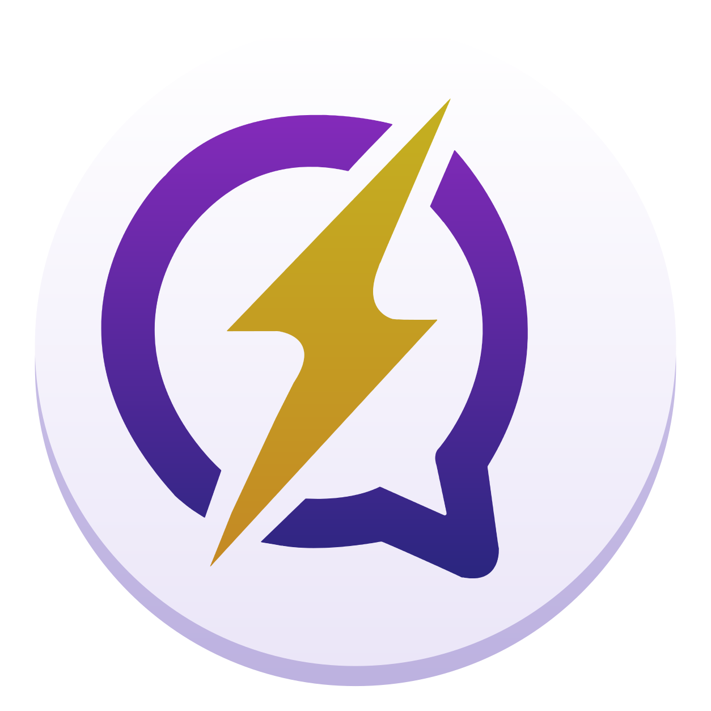
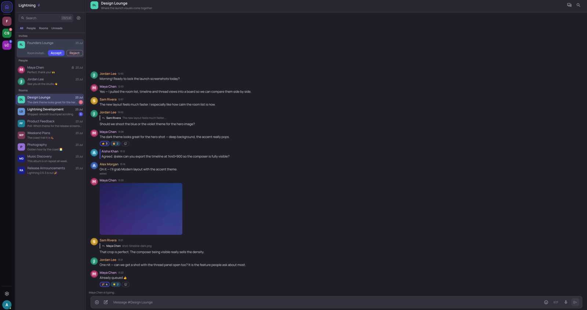
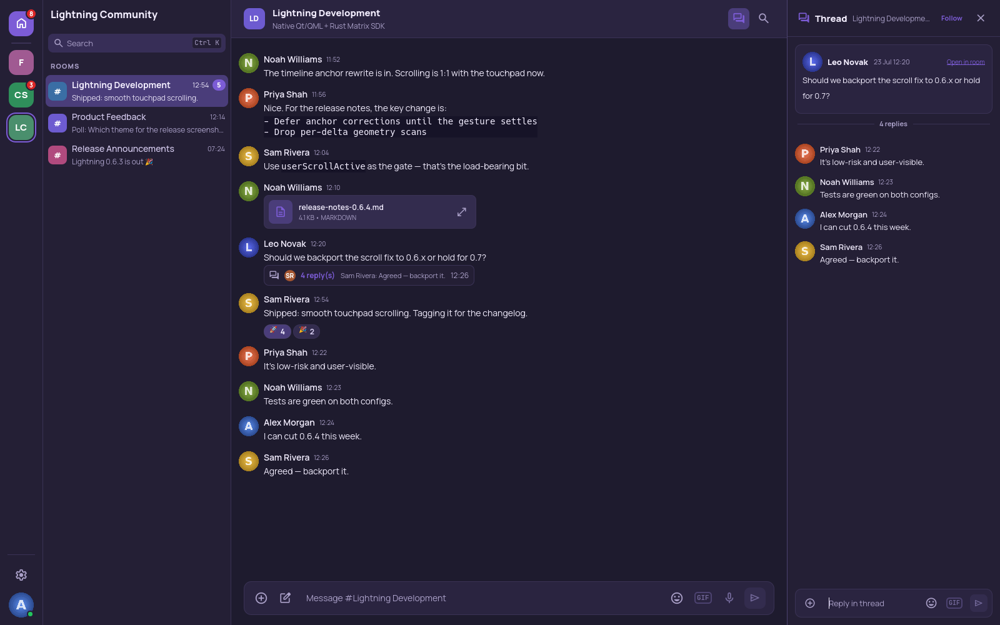
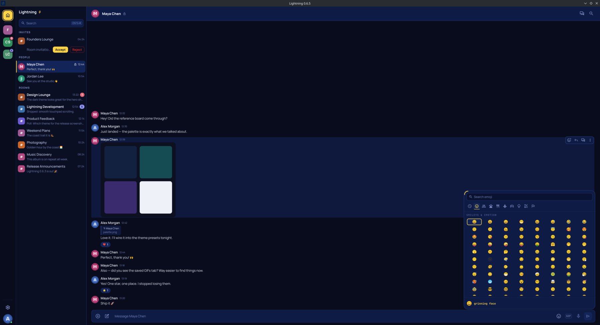
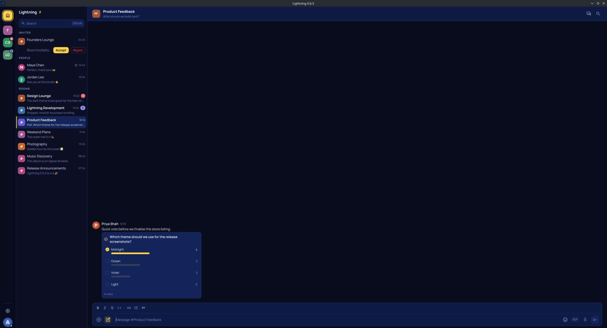

<div align="center">



# ⚡ Lightning

**A fast, native Matrix desktop client — Qt 6 on top of the official Rust Matrix SDK.**

[](LICENSE)
[](https://gitlab.smetonis.net/Mizerd/lightning/-/releases)
[](#installation)
[](https://www.qt.io/)
[](https://github.com/matrix-org/matrix-rust-sdk)


</div>

Lightning is a desktop [Matrix](https://matrix.org/) client for **Linux and
Windows**. The interface is Qt 6 / QML with C++ for the application layer, and
the official [`matrix-rust-sdk`](https://github.com/matrix-org/matrix-rust-sdk)
owns synchronisation, timelines, end-to-end encryption, threads, and media —
Lightning implements no Matrix cryptography of its own.

|  |  |
|---|---|
| **Native, not a web view** | Qt 6 / QML shell with a four-pane layout and eleven WCAG-AA themes |
| **Real E2EE** | SDK-owned Olm/Megolm, cross-signing, SAS **and** QR verification, key backup |
| **Threads that work** | SDK thread timelines, a dedicated panel, summary cards, threaded receipts |
| **Multi-account** | Several homeservers at once, isolated stores, in-place switching |
| **Rich composer** | Markdown, mentions, polls, GIFs, emoji, attachments — in rooms and threads |
| **Open source** | GPL-3.0-or-later, packaged for both platforms |

> **Status:** under active development (0.7.x). Usable day to day, but not
> formally audited or certified — expect rough edges and occasional
> regressions. Linux is the primary development and support target; Windows
> (x86-64) packages ship alongside every release from v0.6.3 onward.

## Contents

- [Quick start](#quick-start)
- [Features](#features)
- [Screenshots](#screenshots)
- [Installation](#installation)
- [Building from source](#building-from-source)
- [Screenshot-demo mode](#screenshot-demo-mode)
- [Architecture](#architecture)
- [Security and privacy](#security-and-privacy)
- [Project status](#project-status)
- [Development and testing](#development-and-testing)
- [Contributing](#contributing)
- [Packaging and releases](#packaging-and-releases)
- [Licence](#licence)

## Quick start

```sh
# Prebuilt packages: https://gitlab.smetonis.net/Mizerd/lightning/-/releases
# Or build and run from source (Nix dev shell):
git clone https://gitlab.smetonis.net/Mizerd/lightning.git
cd lightning
nix develop -c cmake -S . -B build-rust -G Ninja -DENABLE_RUST_SDK_BACKEND=ON
nix develop -c cmake --build build-rust -j"$(nproc)"
nix develop -c ./build-rust/matrix-client --backend=rust
```

See [Installation](#installation) for packages and
[Building from source](#building-from-source) for the full workflow.

## Features

Everything below is implemented in the current codebase. Because Lightning is
still developing, some workflows remain experimental.

### Accounts, rooms and Spaces

- Password login, persistent sessions and restoration, and logout
- **Browser sign-in (OAuth 2.0 / OIDC)** on homeservers that offer it —
  live-validated against matrix.org, including new-account registration
  through an upstream identity provider. Lightning asks the server which
  authentication methods it actually supports as you type the homeserver
  and offers only those — nothing is hard-coded for any provider. The browser flow is owned by the Matrix Rust SDK (`Client::oauth()`):
  the SDK builds the authorization URL with PKCE, validates the CSRF state,
  exchanges the code, and refreshes access tokens. Lightning contributes only
  the system-browser launch and a single-shot loopback listener bound to
  127.0.0.1 on an ephemeral port.
  Sign-in runs in two phases so that a device the server has just created can
  never attach to another device's encryption store: authentication happens with
  no local store at all, and the account's store is chosen, checked and opened
  only after the homeserver has named the user and device.
  Legacy Matrix SSO is **detected but not supported** — Lightning tells you when
  a server offers only that, rather than presenting a button that cannot work.
- **Multi-account**: several signed-in accounts across any mix of homeservers,
  with fast in-app switching and no login form between them; each account keeps
  its own isolated SDK and encryption store, and only the active account syncs
- Scoped account removal and logout that never touch other accounts
- Joined rooms, direct messages, invites, and Matrix Space hierarchy
  navigation, with a **Space front page** (double-click a Space in the rail)
  listing its rooms
- Room creation, member lists and roles, room-profile editing, and invites
- **Moderation**: kick, ban and unban from the member profile, gated by real
  power-level permissions; banned members stay visible so unban is
  reachable, and unbanning can invite the user straight back
- **Member roles / power levels**: inspect and change a member's real
  `m.room.power_levels` value from their profile. Lightning offers only the
  changes Matrix would actually allow — never above your own level, never
  against a peer at or above it, self-demotion only — and it never rounds a
  room's custom numbers into a preset: a member at 42 reads as "Custom (42)"
  and stays at 42 unless you change it. Nothing is applied locally; the
  authoritative levels come back from the room
- **Room access**: change who can join (invited people only / anyone with the
  link / ask to join) and publish or clear the room's address, both gated by
  the room's own required power level for that state event. A
  space-restricted room is shown honestly and left alone — Lightning does not
  yet build the allow-rule list those rules carry
- **Presence** — online / away / offline dots for other people on 1:1 DM rows,
  the People list and the member profile popover, with a "last active" line in
  the popover. Sliding Sync carries no presence events, so this is a bounded
  poll of exactly the users currently on screen; a state Lightning does not
  know renders **nothing** rather than a made-up "offline". Your own state is
  published behind Privacy & security → "Share my online status" (default on;
  turning it off publishes one final offline)
- **Room list filters** — All / People / Rooms / Unreads chips, persisted
  per account, so busy DM lists never bury your rooms
- Keyboard quick switcher (Ctrl-K) with a **navigate mode** across rooms, DMs,
  Spaces, and invites and a **command mode** (`>`) with scope chips, plus
  find-in-timeline (Ctrl-F) across the currently loaded timeline, which
  highlights every match and fills the one you are stepping through

### Messaging and timelines

- Live timelines with replies, edits, reactions, redactions, mentions, and
  typing indicators
- **Read receipts** as Element-style avatar chips riding a fixed right-edge
  rail, with a "+N" overflow pill and a "Read by …" summary for the tooltip
  and screen readers
- **Per-user name colours** — every sender keeps one deterministic,
  WCAG-AA-checked colour, matched to their avatar, across every surface
- **MSC3381 polls** — vote, change your vote, and see live tallies
- **Pinned messages** (`m.room.pinned_events`) — pin and unpin from the
  message menu when the room's power levels allow it, and read the room's
  pins from a Pinned tab in Room Information. Clicking one jumps to the
  original message through the same navigation replies and permalinks use, so
  a pin outside the loaded window loads its history like any other jump. A
  pin whose event is deleted or unreachable says exactly that and goes
  nowhere, rather than landing you on an unrelated message; pins changed from
  another client appear here without a reload
- Unread and mention states, marked-unread, first-unread and jump-to-latest
  navigation, and backward pagination
- Display names resolved everywhere the member roster knows them — mentions,
  reply headers, and thread summary cards — with the roster hydrated on room
  open
- Content-width reply cards, quiet edge-bar mention highlighting, and member
  profile popovers with Copy ID, plus a room-details panel
- Smooth mouse-wheel and touchpad scrolling with per-room position
  preservation, and a reading position that survives history loading — older
  messages and image pop-in no longer shove the view around

### Threads

- SDK-backed Matrix thread timelines, replies, and threaded read receipts
- Per-room Threads view, a dedicated thread panel, follow/unfollow, and pagination
- Compact Element-style thread summary cards on room-timeline roots
- Text, image, and file attachments in threads, including encrypted rooms

### Media

- Images, files, and clipboard images, including encrypted attachments
- **Voice messages** (MSC3245) — record with a live waveform and send, in
  rooms and threads, as mono Opus through the SDK's encrypting media path
- Inline **video and audio playback** with posters, duration, and waveforms;
  outgoing videos carry a locally extracted poster thumbnail
- Animated GIF attachments and a multi-provider GIF browser (GIPHY and KLIPY):
  trending, search, categories, recents, safe-search, and autoplay policy,
  sending as real Matrix media into rooms and threads
- **Saved GIFs** — one star, one meaning, one place. Star a GIF anywhere (a
  provider tile or a GIF in a chat) and it lands in the picker's **Saved** tab.
  Provider GIFs are saved as links; a GIF saved out of a chat is copied to your
  device, in an account-scoped store bounded at 200 items / 64 MiB that is
  deleted on sign-out and disclosed in Settings. Each tile is tagged with where
  it came from (GIPHY / KLIPY / Local)
- Client-side link previews with encrypted-room privacy controls
- Image viewer with save, and validated inline rendering of direct raster links

### Encryption and account security

- Encrypted send/receive through the Rust Matrix SDK, with automatic key
  handling, late in-place decryption, and manual retry
- SAS emoji device verification **in both directions** (either device may
  initiate) and read-only session-trust information, including a Trust card
  bound to real crypto-health state. Verification runs in a **focused centred
  dialog** — the emojis you are comparing against another device are never
  buried at the bottom of a scrolled page — and the same dialog handles a
  verification another client starts
- **Unverified-session prompts you can turn off.** A new session gets one
  corner prompt offering Verify or Not now, and a small red dot on the
  settings cog and the Sessions row. "Stop reminding me" silences those
  badges for that account and persists; it never claims the session is
  verified, the Sessions page keeps stating the fact plainly, and the
  reminder returns by itself if a later session is unverified
- Secure Backup recovery-key or passphrase restore and encrypted room-key import
- Crypto health, recovery, and diagnostics controls in Settings
- A sanitized support-diagnostics export (hashed account identifiers, no
  paths, no tokens), offered from the sign-in repair flow when a
  session-store failure is detected

### Desktop experience and personalization

- The **Storm design language** (new in 0.6.5) across the whole menu system:
  redesigned context menus with keycap accelerators and a quick-reaction strip,
  a per-room notifications flyout, redesigned emoji/GIF pickers and mention
  popup, identity cards in the account switcher, and dialogs (new conversation,
  invite people, create poll) in one shared visual language
- Eleven complete, WCAG-AA-tested semantic themes — **Storm** (the deep-navy,
  bolt-yellow brand theme; *System* resolves to Storm in dark mode and Moss
  Light in light mode), Moss Light, Indigo Night, Deep Teal, plus Lightning
  Light/Dark, Graphite, Midnight, Nordic, Purple Dusk, and Warm — persistent
  and live-switching, with a message-layout selector and text-size scaling
  (all per-account)
- A searchable full-view Settings screen with featured theme cards and the
  Trust card embedded in Sessions
- Bundled Manrope, JetBrains Mono, and Space Grotesk (brand) fonts, and five
  selectable UI fonts
- Native freedesktop notifications with mentions, active-room suppression,
  privacy modes, and sounds. **Per-room modes** (All messages / Mentions &
  keywords / Mute) are written to your account's server push rules by the SDK,
  so a muted room stays muted on your other clients
- **Resizable pickers** — the GIF and emoji pickers sit on the composer and
  scale with the window. Drag the corner to resize either one; both share a
  single remembered size, stored as a proportion so it stays sensible across
  window sizes and displays, and it persists between sessions
- Responsive layouts from narrow to wide, a local Unicode emoji picker, an
  installed application icon and desktop entry, and accessible keyboard navigation

### Updating

- **Lightning can update itself** (new in 0.7.1). Settings → Updates checks for
  a new release and, where the package type allows it, installs it: MSI and
  Setup EXE through their own installers, portable ZIP and AppImage replaced
  transactionally with rollback, DEB and RPM handed to your package manager
  through PolicyKit so those files stay package-manager owned. Flatpak and Snap
  are left to their own ecosystems, and a development build never installs
  anything
- Every update is verified before it is installed: an **Ed25519-signed
  manifest** decides the exact filename, size and SHA-256, the signature is
  checked over the raw bytes before a single field is read, and a failure of
  either check is terminal — there is no "install anyway". The manifest names a
  file and can never name a command
- Binaries download from the read-only GitHub mirror first (falling back to
  GitLab) purely to save the project's bandwidth. GitLab stays the release
  authority: Lightning makes no GitHub API call and reads no GitHub release
  metadata, so a compromised mirror can break a download but cannot ship an
  update
- **Automatic checks are off by default.** A check sends only
  `Lightning/<version>` — no Matrix ID, homeserver, device ID, token, room data,
  or analytics identifier, and no updater tracking ID is generated at all. See
  [Application updates](docs/updates.md)

## Screenshots

<table>
  <tr>
    <td width="50%">
      <br>
      <sub><b>Rooms and GIFs</b> — the timeline, and the GIF picker pinned to the composer.</sub>
    </td>
    <td width="50%">
      <br>
      <sub><b>Threads</b> — a dedicated panel beside the room, with summary cards inline.</sub>
    </td>
  </tr>
  <tr>
    <td width="50%">
      <br>
      <sub><b>Emoji</b> — categories, search and a live preview, in an encrypted DM.</sub>
    </td>
    <td width="50%">
      <br>
      <sub><b>Polls</b> — create and vote inline, with live counts.</sub>
    </td>
  </tr>
</table>

> Every screenshot comes from Lightning's development-only
> [screenshot-demo mode](#screenshot-demo-mode): fictional `*.example` accounts
> and locally generated media, never real conversations.

## Installation

Prebuilt packages are attached to the project's
[**Releases**](https://gitlab.smetonis.net/Mizerd/lightning/-/releases) page and
published to its GitLab Package Registry.

- **Linux** (primary platform): `.deb`, `.rpm`, Flatpak, AppImage, and Snap.
- **Windows** (x86-64 only; Windows 10 or later): a portable `.zip`, an `.msi`
  installer, and a `-setup.exe` installer, available since v0.6.3. There is no
  32-bit or ARM64 build.
- **macOS** is not currently supported.

**Windows artifacts are currently unsigned**, so Windows will show an "unknown
publisher" / SmartScreen warning. Code signing through
[SignPath Foundation](https://signpath.org/) is *planned* — it has not been
applied for, granted, or activated, and no Lightning release is signed today. See
the [**Code signing policy**](docs/code-signing-policy.md) for how signing will
work, and [`docs/windows-signing-inventory.md`](docs/windows-signing-inventory.md)
for exactly which files would be signed. Verify a download against the published
`SHA256SUMS` in the meantime.

**Installing and removing on Windows**

- *Portable ZIP* — extract anywhere and run `Lightning.exe`. Nothing is
  installed, no registry keys are written; delete the folder to remove it.
- *MSI* — installs per-user under `%LOCALAPPDATA%\Programs\Lightning` with a
  Start-menu shortcut. Remove it from **Settings → Apps → Installed apps**, or
  with `msiexec /x`.
- *Setup EXE* — installs per-user to the same location and registers a normal
  uninstall entry. Remove it from **Settings → Apps → Installed apps**, or with
  the **Uninstall Lightning** Start-menu shortcut.
- Neither installer requires administrator rights, and neither modifies `PATH`,
  file associations, URL protocols, services, scheduled tasks, firewall rules, or
  autostart. Uninstalling removes the application and its shortcuts, and
  deliberately leaves your Matrix session, settings, and message stores alone —
  those live in your user profile, outside the install directory, and are removed
  by signing out of the account inside the app.

The authoritative per-release list of artifacts is the release notes — for
example [`docs/releases/v0.7.0.md`](docs/releases/v0.7.0.md) — and the Releases
page itself. Packaging, cross-platform builds, publishing, and verification are
maintained in a separate automation project,
[**lightning-deploy**](https://gitlab.smetonis.net/Mizerd/lightning-deploy); this
repository holds only the application source. If no package is available for your
platform, build from source (below).

## Building from source

The verified development workflow uses the repository's Nix flake on Linux, with
Qt 6.5+ and a Rust toolchain (Rust 2021 edition) provided by the dev shell.

```sh
git clone https://gitlab.smetonis.net/Mizerd/lightning.git
cd lightning
nix develop
```

**Production build** — the Rust SDK backend (real Matrix, E2EE, threads):

```sh
nix develop -c cmake -S . -B build-rust -G Ninja -DENABLE_RUST_SDK_BACKEND=ON
nix develop -c cmake --build build-rust
nix develop -c ./build-rust/matrix-client --backend=rust
```

**Developer build** — a lighter tree with the in-memory mock/experimental HTTP
backends, for UI work and tests without a homeserver:

```sh
nix develop -c cmake -S . -B build -G Ninja
nix develop -c cmake --build build
```

The Rust backend is required for real Matrix, encryption, and thread features.
Release binaries are Rust-only (`-DLIGHTNING_RUST_ONLY=ON`); the mock and HTTP
backends are development-only and are compiled out of release builds.

**Faster local rebuilds (optional).** `ccache` and `mold` are in the dev shell,
but nothing uses them unless you ask at configure time:

```sh
nix develop -c cmake -S . -B build-rust -G Ninja -DENABLE_RUST_SDK_BACKEND=ON \
  -DCMAKE_CXX_COMPILER_LAUNCHER=ccache -DCMAKE_LINKER_TYPE=MOLD
```

This is worth it because changing a widely included header, or adding a target,
makes CMake recompile ~6100 objects and relink ~40 executables. The choice is
written into that tree's own `CMakeCache.txt`, which is untracked — it is
purely local, it changes nothing about the produced binaries, and official
packages are built without it.

See [`docs/build-and-test.md`](docs/build-and-test.md) for the full details.

## Screenshot-demo mode

A development-only mode boots the **real** UI on the in-memory mock backend with
three fictional accounts, locally generated media, and deterministic scenarios —
no network, no Matrix credentials, no real stores. It is how the screenshots on
this page were produced, and it is impossible to reach in a shipped binary.

```sh
scripts/run-screenshot-demo.sh --scenario main-chat --hide-controls
```

Scenarios default to the Storm theme, and the GIF picker is browsable there —
it is seeded with bundled animated fixtures rather than reaching a provider, so
the picker photographs like a real session without a network or an API key.

See [`docs/screenshot-demo.md`](docs/screenshot-demo.md) for accounts, scenarios,
window presets, and the full option list.

## Architecture

Lightning keeps presentation, application state, and Matrix behaviour separate:

```text
Qt 6 / QML  ──  visual presentation, interaction, theming, layout
     │
C++         ──  application state, Qt-facing models/controllers, lifecycle,
     │          account/room/thread isolation, navigation, notification policy
Rust bridge ──  FFI to…
     │
matrix-rust-sdk  ──  login/sync, timelines, threads, event cache, media,
                     Olm/Megolm E2EE, verification, key backup, receipts
```

- **QML** owns presentation and interaction only — never protocol, credentials,
  crypto, or persistence.
- **C++** owns the safe Qt-facing boundary and application state.
- The **official Rust Matrix SDK** owns all Matrix protocol and cryptography.
- The development-only mock and screenshot-demo backends are compiled out of
  release builds. See [`docs/architecture.md`](docs/architecture.md).

## Security and privacy

- End-to-end encryption is handled entirely by the official Rust Matrix SDK;
  Lightning implements no custom Matrix cryptography.
- Encrypted-room plaintext is kept in memory only and is not written to
  application caches; cryptographic material, tokens, recovery keys, and message
  bodies are never logged.
- Access tokens are stored in the OS secret service (libsecret / Windows
  Credential Manager) where available, with a clearly-flagged insecure fallback.
- The screenshot-demo mode never touches real accounts, stores, libsecret, or the
  network, and cannot exist in a release binary.

Lightning collects nothing: there is no analytics, telemetry or crash reporting,
and the project operates no server. Apart from the homeserver you sign in to,
the only third parties Lightning can contact are the GIF providers, and only
while you are using the GIF picker. Automatic link-preview fetching is **off by
default**, because Lightning fetches previews itself rather than through your
homeserver, which would expose your IP address to a site the sender chose.

Lightning can check for its own updates, and that check is **off by default**.
A check is an anonymous HTTPS request for two small public files from the
project's own GitLab — it never sends your Matrix ID, homeserver, device ID,
tokens, room data, or any analytics or updater identifier, and no tracking ID
of any kind is generated. You can also check manually at any time from
Settings → Updates.

GitLab is the release authority: it alone decides what version exists and what
its bytes must hash to. When you install an update the file itself is fetched
from the read-only GitHub mirror first, to keep that bandwidth off the project's
server, falling back to GitLab if the mirror cannot supply it. Lightning makes
no GitHub API call and reads no GitHub release metadata — the mirror's URL is
part of the signed manifest, and whatever it returns is checked against a
SHA-256 that was fixed before the download began, so a compromised mirror can
break a download but cannot ship an update. A failed signature or hash check is
terminal, with no way to proceed. Flatpak and Snap installations are left to
their own package managers. See **[Application updates](docs/updates.md)** for
the full trust chain, the per-package behaviour, and the honest signing status.

- **[Privacy policy](docs/privacy.md)** — every network path, derived from the
  source, with what is sent and how to disable it.
- **[Application updates](docs/updates.md)** — what is contacted, what is never
  sent, how an update is verified, and what each package format does.
- **[Code signing policy](docs/code-signing-policy.md)** — signing roles,
  approval, and current (unsigned) status.
- **[Third-party notices](docs/third-party-notices.md)** — what is shipped
  inside a release and under which licence.

Lightning has **not** been formally security audited. Security-sensitive changes —
especially anything touching E2EE — require careful review, explicit reasoning,
and tests. See [`docs/threat-model.md`](docs/threat-model.md).

## Project status

Lightning is listed in the official [Matrix.org client
directory](https://matrix.org/ecosystem/clients/) as an **Alpha** Matrix client
for Windows and Linux, under GPL-3.0-or-later. That is a directory listing, not
an endorsement, certification, or approval by the Matrix.org Foundation.

Lightning is under active development. Linux is the primary development and
support target; official Windows (x86-64) packages are published as of v0.6.3.
APIs, UI, and behaviour may change, some features are experimental (for example,
voice-message *recording* is not yet implemented, and message search covers the
loaded timeline rather than the full server-side history), and Matrix
interoperability should be verified rather than assumed. It should not be treated
as a finished or certified product.

## Development and testing

```sh
# Rust SDK tests
nix develop -c cargo test --manifest-path rust/Cargo.toml

# C++/QML/controller tests for a built tree (build the tree first)
nix develop -c ctest --test-dir build-rust --output-on-failure
nix develop -c ctest --test-dir build       --output-on-failure
```

Compilation and launch are not feature validation; live Matrix behaviour
(interoperability, decryption, notifications, physical scrolling) must be tested
on a real homeserver and reported honestly. See
[`docs/build-and-test.md`](docs/build-and-test.md).

## Contributing

Issues, focused merge requests, testing, and bug reports are welcome. Please:

- keep commits scoped and coherent, and run the relevant tests;
- keep security- and crypto-related changes especially focused, with explicit
  reasoning and tests;
- never commit credentials, provider keys, private stores, or real conversations.

The source is publicly readable under GPL-3.0-or-later. Direct write access to
the canonical repository is currently limited to the maintainer, and public
registration, forks, or merge-request submission may not be enabled on this
GitLab instance — contact the maintainer for access. `CLAUDE.md` documents the
repository's operating conventions (primarily for coding agents).

## Packaging and releases

This repository contains the Lightning **application source**. Packaging,
cross-platform package builds, release publishing, and artifact verification are
maintained separately in
[**lightning-deploy**](https://gitlab.smetonis.net/Mizerd/lightning-deploy).
Official packages are still published under this main Lightning project's Package
Registry and attached to its
[Releases](https://gitlab.smetonis.net/Mizerd/lightning/-/releases);
`lightning-deploy` holds only the pipeline and automation logic. Releases are
package-first: the tag and GitLab Release are created only after the packages are
built, validated on a clean system, published, and verified.

Every package is built by CI from one exact, immutable source commit — never
from a developer's machine. See
[`docs/signpath-build-provenance.md`](docs/signpath-build-provenance.md).

### Code signing policy

Windows artifacts are **not signed yet**. The
[**Code signing policy**](docs/code-signing-policy.md) documents the signing
roles (authors/committers, reviewers, approvers), the manual per-release approval
step, and precisely which binaries would be signed
([signing inventory](docs/windows-signing-inventory.md)). It will be updated to
say releases are signed only once a signed release actually ships.

### Source repositories

The canonical repository — the only one that accepts changes, runs releases, and
is authoritative for provenance — is
<https://gitlab.smetonis.net/Mizerd/lightning>.
[github.com/Mizerd/lightning](https://github.com/Mizerd/lightning) is an
**automatically synchronised, read-only mirror**, provided for discoverability
and for update downloads. It carries byte-identical copies of the release
artifacts GitLab published, so installed clients can fetch them from there
instead of the project's own server — but it is never a build source and never
a release authority: it decides no version, holds no signing key, and every
byte it serves is checked against a hash GitLab signed. Merge requests opened
there are not seen; please use the GitLab project or contact the maintainer.

## Licence

Copyright © 2026 Rokas Smetonis.

Lightning is free software licensed under the GNU General Public License v3.0 or
later. See [LICENSE](LICENSE).

---

**Maintainer:** Rokas Smetonis — [antrasrokas@gmail.com](mailto:antrasrokas@gmail.com)
· Public source: <https://gitlab.smetonis.net/Mizerd/lightning>
