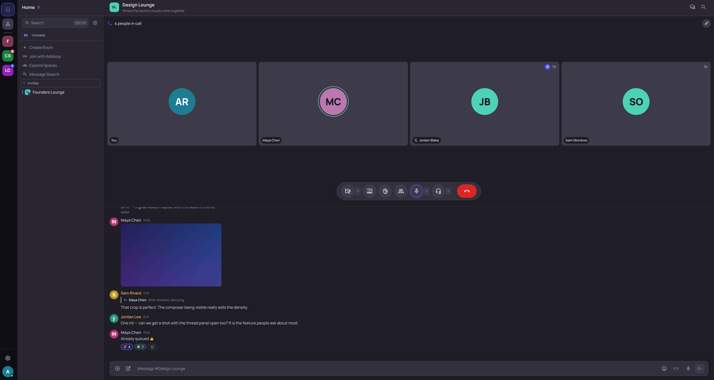
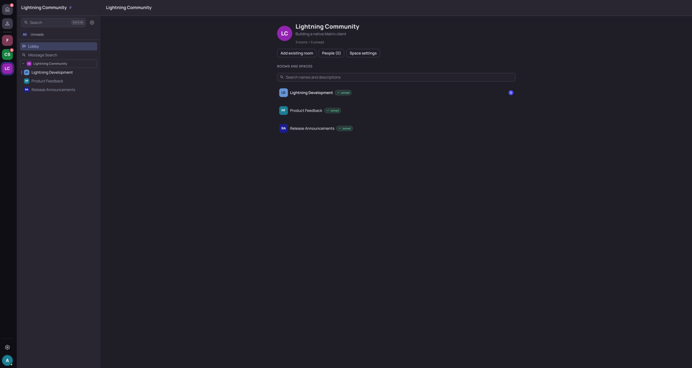
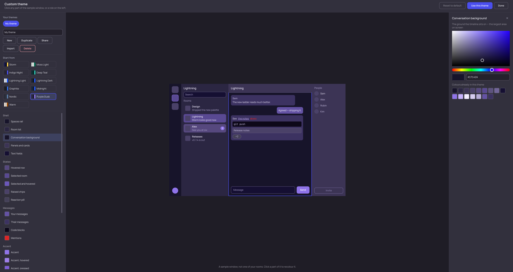

<div align="center">


# Lightning

**A native desktop Matrix client — Qt 6 on top of the official Rust Matrix SDK.**

[](LICENSE)
[](https://gitlab.smetonis.net/Mizerd/lightning/-/releases)
[](#install)

</div>

Lightning is a desktop [Matrix](https://matrix.org/) client for Linux, Windows and
macOS. The interface is Qt 6 / QML with C++ for the application layer, and the
official [`matrix-rust-sdk`](https://github.com/matrix-org/matrix-rust-sdk) owns
synchronisation, timelines, end-to-end encryption, threads and media — Lightning
implements no Matrix cryptography of its own. It is not Electron, not a web view,
and not a fork of another client.

Linux is the primary development and support target. Windows (x86-64) packages ship
with every release from v0.6.3, and macOS (Apple Silicon) from v0.7.5. Lightning is
under active development: usable day to day, but not audited or certified — expect
rough edges and occasional regressions.


## What it does

**Messaging.** Live SDK timelines with replies, edits, reactions, redactions,
mentions, typing indicators and read receipts — receipts as Element-style avatar
chips you can click for the reader list. Pinned messages, message forwarding
(media is re-uploaded rather than mxc-copied, so the target room can actually
fetch it), polls (MSC3381), drafts that survive a room switch, and `@room` where
the room's own power level allows it. Search uses the homeserver's own index in
unencrypted rooms and the loaded timeline in encrypted ones, and says which it is
doing — a server cannot search ciphertext.

**Threads.** Real Matrix threads on SDK thread timelines: a side panel, a per-room
Threads view, summary cards with participant facepiles, threaded read receipts,
follow/unfollow, and text, image, file and voice replies including in encrypted
rooms.

**Calls.** Group calls over MatrixRTC — audio, camera and screen sharing — talking
to Element Call, including raised hands, per-participant volume, speaking
indication and mute. A share can carry **the computer's audio** as well as your
microphone, as a separate encrypted track, and a viewer can set that share's
volume independently of the person sharing it. Resolution and frame rate are
selectable, and the convert-and-scale stage runs **on the GPU** where the
system supports it, falling back to the CPU with a reason in the log where it
does not. On Windows you can share a single **window** rather than a
whole display, through a GStreamer capture element Lightning ships itself. Windows
and macOS packages bundle GStreamer, so calling works without installing anything
alongside them. Calls are live-validated against Element on Linux — from the
AppImage, the rpm and the Flatpak — and on a packaged Windows build; the deb is
believed to work by inference from the rpm rather than tested, and **macOS
calling is not tested**.

**Spaces and navigation.** Two navigation layouts, chosen per account. *Classic* is
one activity-ordered conversation list. *Channels* is a Spaces rail with a Home
view, a Direct Messages view and one view per Space — with nested Matrix
subspaces, device-local folders you make by dropping one Space onto another, and
drag-to-reorder. A Space's front page lists its rooms and subspaces together, each
stating its own membership, with in-place editing of the Space where your power
level allows. Public-directory browsing, joining by address or `matrix:` URI,
knocking, moderation and role changes, and room access settings are all gated by
what Matrix would actually permit.

**Encryption and accounts.** SDK-owned Olm/Megolm with cross-signing, SAS **and**
QR device verification, Secure Backup restore, key import, and late in-place
decryption when keys arrive. Sign in with a password or through the homeserver's
own browser flow (OAuth 2.0 / OIDC, live-validated against matrix.org). Several
accounts on different homeservers at once, each with an isolated SDK and
encryption store, switching in place; only the active one syncs.

**Media and the composer.** Images, video and audio with inline playback, posters
and waveforms; encrypted attachments throughout; voice messages (MSC3245) with a
live waveform, in rooms and threads; a two-provider GIF browser (GIPHY and KLIPY)
that sends real Matrix media and never sends a provider anything but your search
term; a local emoji picker; MSC2545 sticker packs — your own, a room's, and
packs subscribed from elsewhere — with a browser and save-to-pack; JPEG XL
alongside the usual formats; drag-and-drop; and link previews, off by
default because Lightning fetches them itself rather than through your
homeserver, and separately controllable for encrypted rooms.

**Desktop.** Eleven WCAG-AA themes and an editor for your own, which you can name,
keep and share as a block of text. Eleven languages, switchable without a restart,
including right-to-left Arabic. Native notifications with per-room modes written to your
account's server push rules, close-to-tray, resizable and hideable panes, a quick
switcher (Ctrl-K), rebindable shortcuts, native spell checking in the composer,
your own imported fonts, and keyboard navigation throughout.

**Updates.** Settings → Updates checks for a new release and, where the package
format allows, installs it. An Ed25519-signed manifest fixes the filename, size
and SHA-256 before anything is downloaded; a failed signature or hash check is
terminal. Checks are on by default, can be turned off, and send nothing but
`Lightning/<version>` — no Matrix ID, homeserver, device ID, token or tracking
identifier of any kind. See [Application updates](docs/updates.md).

## Screenshots

<table>
  <tr>
    <td width="50%">
      <br>
      <sub><b>Calls</b> — a four-person MatrixRTC call: speaking ring, raised hand, muted and camera-off badges, over the room.</sub>
    </td>
    <td width="50%">
      <br>
      <sub><b>Threads</b> — a dedicated panel beside the room, with the summary card inline.</sub>
    </td>
  </tr>
  <tr>
    <td width="50%">
      <br>
      <sub><b>Channels layout</b> — a Space's own view in the rail, with its lobby and rooms.</sub>
    </td>
    <td width="50%">
      <br>
      <sub><b>Theme editor</b> — click any part of the sample window, or a role, to recolour it.</sub>
    </td>
  </tr>
</table>

> Every screenshot comes from Lightning's development-only
> [screenshot-demo mode](docs/screenshot-demo.md): fictional `*.example` accounts
> and locally generated media, never real conversations.

## Install

Packages are attached to the
[**Releases**](https://gitlab.smetonis.net/Mizerd/lightning/-/releases) page and
mirrored to [GitHub Releases](https://github.com/Mizerd/lightning/releases). Every
release ships a `SHA256SUMS` file; verifying is worth the one command, because no
package is code-signed yet:

```sh
sha256sum -c SHA256SUMS --ignore-missing
```

Replace `0.8.3` below with the version you downloaded.

### Linux

```sh
sudo apt install ./lightning_0.8.3_amd64.deb            # Debian, Ubuntu, Mint, Pop!_OS
sudo dnf install ./lightning-0.8.3-1.x86_64.rpm         # Fedora, RHEL
sudo zypper install ./lightning-0.8.3-1.x86_64.rpm      # openSUSE

# The VERSION stays in the pattern; only the suffix is globbed, because some
# browsers and download managers lower-case .AppImage on the way in. Do not
# widen it to Lightning-*: with two versions in the same directory the shell
# expands to both, and the OLDER one becomes the command while the newer
# becomes its argument — so you would silently run the build you just
# replaced.
chmod +x Lightning-0.8.3-x86_64.*pp[Ii]mage && ./Lightning-0.8.3-x86_64.*pp[Ii]mage

flatpak remote-add --if-not-exists --user flathub https://flathub.org/repo/flathub.flatpakrepo
flatpak install --user flathub org.kde.Platform//6.9     # the runtime, once
flatpak install --user ./lightning_0.8.3_amd64.flatpak
flatpak run org.lightning_matrix.Lightning

sudo snap install --dangerous ./lightning_0.8.3_amd64.snap
```

The leading `./` matters for `apt` and `dnf`, or they look for a package by that
name in your repositories. The AppImage installs nothing — delete the file to
remove it; if it will not start you may need FUSE, or run it with
`--appimage-extract-and-run`. The snap is not published to the Snap Store, so
`--dangerous` means "this file is not signed by the store", not that the snap is
unsafe; it is built with `strict` confinement.

### NixOS

If you want to use it without installing:

```sh
nix run github:Mizerd/lightning
```

**Installing using flakes**:

Add lightning-matrix-client as an input:

```nix
{
  inputs = {
    nixpkgs.url = "github:nixos/nixpkgs?ref=nixos-unstable";
    lightning-matrix-client = {
      url = "github:Mizerd/lightning";
      #url = "github:Mizerd/lightning/v0.8.3"; # Use this if you want a specific version
    };
  };
  . . . # Your outputs config
}
```

Add the package from the lightning-matrix-client input:

```nix
{ inputs, pkgs, ... }:
{
  environment.systemPackages = [
    inputs.lightning-matrix-client.packages.${pkgs.stdenv.hostPlatform.system}.default
  ];
}
```

Optionally, the flake also provides a `homeManagerModules` output with settings
(you don't need to add the package to `environment.systemPackages` if using this method):

```nix
# This is a module imported inside a home manager (https://github.com/nix-community/home-manager) configuration
{ inputs, ... }:
{
  imports = [
    inputs.lightning-matrix-client.homeManagerModules.default
  ];
  lightning-matrix-client.enable = true;
}
```

### Windows (x86-64, Windows 10 or later)

Three formats — **MSI**, **Setup EXE** and a **portable ZIP** — all per-user. None
needs administrator rights, and none modifies `PATH`, file associations, URL
protocols, services, scheduled tasks, firewall rules or autostart. MSI and Setup
EXE install to `%LOCALAPPDATA%\Programs\Lightning` with a Start-menu shortcut and
uninstall from Settings → Apps; the portable ZIP writes no registry keys, so
deleting the folder removes it.

Windows packages are **not code-signed**, so Windows shows an "unknown publisher"
SmartScreen warning. Check the hash first
(`Get-FileHash .\Lightning-0.8.3-<sha>-windows-x86_64.msi -Algorithm SHA256`),
then choose *More info → Run anyway*. Signing through
[SignPath Foundation](https://signpath.org/) is planned but has not been applied
for or granted — see the [code signing policy](docs/code-signing-policy.md).

### macOS (Apple Silicon, macOS 26 or newer)

Apple Silicon only, and macOS 26 or newer: both limits are derived from the Qt
frameworks the bundle links, not chosen. Unzip and drag **Lightning.app** into
`/Applications`.

The app is not signed with an Apple Developer ID and not notarized, so the first
launch is refused. Double-click it and let macOS refuse — the button only appears
after it has blocked the app once — then open **System Settings → Privacy &
Security**, click **Open Anyway** next to the message, and confirm. macOS
remembers the decision. Clearing the quarantine flag directly does the same thing:

```sh
xattr -dr com.apple.quarantine /Applications/Lightning.app
```

Two honest limits: the macOS build **does not update itself** — Lightning will
tell you a new version exists, but installing it means downloading the next zip —
and **nobody has clicked through it on a Mac**. The pipeline proves the bundle's
frameworks load and the binary runs; that is all. Please report what you find.

### Afterwards

Uninstalling removes the application and its shortcuts and deliberately leaves
your Matrix session, settings and message stores alone: those live in your user
profile, outside the install directory, and are removed by signing out of the
account inside the app. Once installed, Lightning can update itself — see
[Application updates](docs/updates.md).

Packaging, cross-platform builds, publishing and verification live in a separate
automation project,
[**lightning-deploy**](https://gitlab.smetonis.net/Mizerd/lightning-deploy); this
repository holds only the application source. Every package is built by CI from
one exact, immutable source commit, never from a developer's machine
([provenance](docs/signpath-build-provenance.md)).

## Build from source

The verified workflow uses the repository's Nix flake on Linux; the dev shell
supplies Qt 6.5+ and a Rust toolchain.

```sh
git clone https://gitlab.smetonis.net/Mizerd/lightning.git
cd lightning

nix develop -c cmake -S . -B build-rust -G Ninja -DENABLE_RUST_SDK_BACKEND=ON
nix develop -c cmake --build build-rust
scripts/run-dev.sh
```

That is the real client: Rust SDK backend, real Matrix, E2EE, threads and calls.
Release binaries are Rust-only (`-DLIGHTNING_RUST_ONLY=ON`).

There is also a lighter tree with the development-only mock and experimental HTTP
backends, for UI work and tests without a homeserver — it is compiled out of
release builds:

```sh
nix develop -c cmake -S . -B build -G Ninja
nix develop -c cmake --build build
```

Tests:

```sh
nix develop -c cargo test --manifest-path rust/Cargo.toml
nix develop -c ctest --test-dir build-rust --output-on-failure
nix develop -c ctest --test-dir build       --output-on-failure
```

Compilation and launch are not feature validation: live Matrix behaviour —
interoperability, decryption, notifications, calls, physical scrolling — has to be
tested against a real homeserver and reported honestly. See
[`docs/build-and-test.md`](docs/build-and-test.md), and
[`docs/screenshot-demo.md`](docs/screenshot-demo.md) for the demo mode the
screenshots on this page come from.

`ccache` and `mold` are in the dev shell and are opt-in per build tree
(`-DCMAKE_CXX_COMPILER_LAUNCHER=ccache -DCMAKE_LINKER_TYPE=MOLD`); they change
nothing about the produced binaries, and official packages are built without them.

## Architecture

```text
Qt 6 / QML  ──  presentation, interaction, theming, layout
     │
C++         ──  application state, Qt-facing models and controllers, lifecycle,
     │          account/room/thread isolation, navigation, notification policy
Rust bridge ──  FFI to…
     │
matrix-rust-sdk  ──  login/sync, timelines, threads, event cache, media,
                     Olm/Megolm E2EE, verification, key backup, receipts
```

QML owns presentation and interaction only — never protocol, credentials, crypto
or persistence. C++ owns the safe Qt-facing boundary and application state. The
official Rust Matrix SDK owns all Matrix protocol and cryptography. See
[`docs/architecture.md`](docs/architecture.md).

## Security and privacy

End-to-end encryption is handled entirely by the Rust Matrix SDK. Encrypted-room
plaintext is kept in memory only and never written to application caches;
cryptographic material, tokens, recovery keys and message bodies are never logged.
Access tokens go to the OS secret service (libsecret, Windows Credential Manager)
where one is available, with a clearly flagged insecure fallback where it is not.

Lightning collects nothing — no analytics, no telemetry, no crash reporting — and
the project operates no server. Apart from the homeserver you sign in to, the only
third parties it can contact are the GIF providers, and only while you have the
GIF picker open. Automatic link-preview fetching is off by default, because
Lightning fetches previews itself rather than through your homeserver, which would
expose your IP address to a site the sender chose.

GitLab is the release authority: it alone decides what version exists and what its
bytes must hash to. Update downloads come from the read-only GitHub mirror first
to keep that bandwidth off the project's server, falling back to GitLab. Lightning
makes no GitHub API call and reads no GitHub metadata — the mirror's URL is part
of the signed manifest, and whatever it returns is checked against a SHA-256 fixed
before the download began, so a compromised mirror can break a download but cannot
ship an update.

- [**Privacy policy**](docs/privacy.md) — every network path, derived from source,
  with what is sent and how to disable it
- [**Application updates**](docs/updates.md) — the trust chain, per-package
  behaviour, and the honest signing status
- [**Code signing policy**](docs/code-signing-policy.md) — roles, approval, and
  current (unsigned) status
- [**Third-party notices**](docs/third-party-notices.md) — what ships inside a
  release, and under which licence

Lightning has **not** been formally security audited. Security-sensitive changes,
especially anything touching E2EE, need explicit reasoning and tests — see
[`docs/threat-model.md`](docs/threat-model.md).

## Status and known limits

Lightning is listed in the Matrix.org [client
directory](https://matrix.org/ecosystem/clients/) as an **Alpha** client under
GPL-3.0-or-later. That is a directory listing, not an endorsement or
certification.

Worth stating plainly:

- Server-side message search covers **unencrypted rooms only**, because a
  homeserver cannot search ciphertext; encrypted rooms search the loaded timeline.
- Space-restricted join rules are displayed but not editable.
- Group calls are live-validated against Element on Linux — AppImage, rpm and
  Flatpak — and on a packaged Windows build. The **deb has not been tested**: it
  declares the same GStreamer dependencies as the rpm, so it is expected to
  behave the same way, but that is reasoning rather than a test. **macOS calling
  has not been tested.**
- A first join can occasionally distribute the call's media key before the
  membership list has been read, and the key then reaches nobody; leaving and
  rejoining the call fixes it.
- Windows and macOS packages are **not signed**; the signed update manifest is the
  integrity guarantee on every platform.
- The macOS build has had **no GUI testing on a Mac** and cannot install its own
  updates.

APIs, UI and behaviour may change, some features are experimental, and Matrix
interoperability should be verified rather than assumed.

## Contributing

Issues, focused patches, testing and bug reports are welcome.
[CONTRIBUTING.md](CONTRIBUTING.md) is the full guide — how to send a change, the
build and test commands, and the security rules. In short: keep commits scoped and
run the relevant tests; keep security- and crypto-related changes especially
focused, with explicit reasoning and tests; never commit credentials, provider
keys, private stores or real conversations. `CLAUDE.md` documents the repository's
operating conventions (primarily for coding agents).

The canonical repository — the only one that accepts changes, runs releases, and
is authoritative for provenance — is
<https://gitlab.smetonis.net/Mizerd/lightning>. Anyone can clone it, but public
registration is closed and its issue tracker, merge requests and forks are limited
to members — so a change arrives either as a patch emailed to the maintainer or as
a pull request on the mirror. Neither needs an account there.

[github.com/Mizerd/lightning](https://github.com/Mizerd/lightning) is an
automatically synchronised, force-pushed **read-only mirror** for discoverability
and update downloads. A pull request opened there is read as a proposal and
applied on GitLab, so it closes rather than merges even when the change ships;
never push to the mirror's own branches, which the next release push overwrites.
Its issue tracker is open, and is the place to file a bug report without an
account. Lightning's home is <https://lightning-matrix.org>.

## Licence

Copyright © 2026 Rokas Smetonis. Lightning is free software licensed under the GNU
General Public License v3.0 **or later** — see [LICENSE](LICENSE).

---

**Maintainer:** Rokas Smetonis — [antrasrokas@gmail.com](mailto:antrasrokas@gmail.com)
· Public source: <https://gitlab.smetonis.net/Mizerd/lightning>
