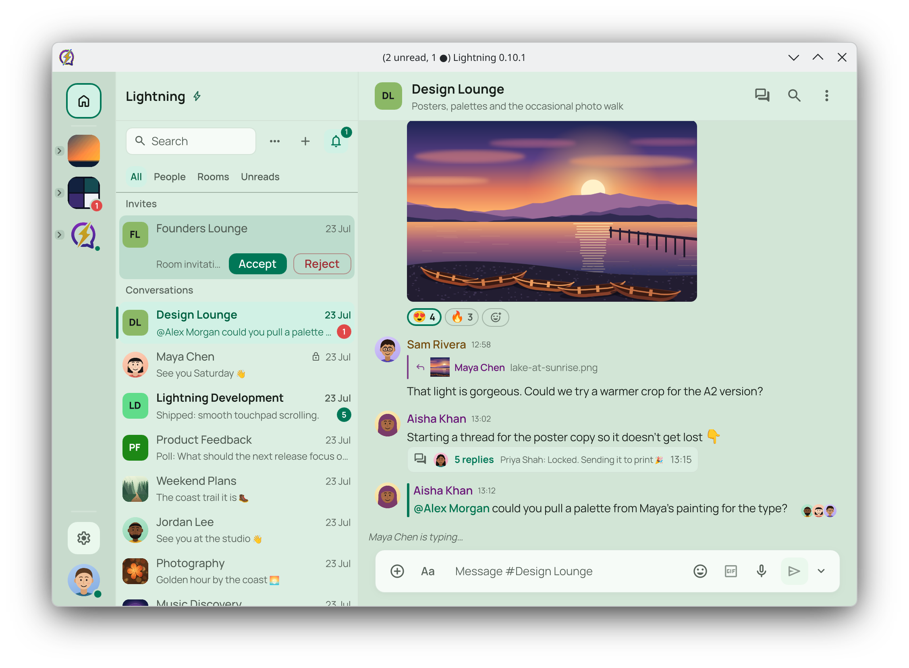

<div align="center">


# Lightning

A native desktop Matrix client: Qt 6 on top of the official Rust Matrix SDK.

[](https://flathub.org/apps/org.lightning_matrix.Lightning)
[](https://gitlab.smetonis.net/Mizerd/lightning/-/releases)
[](LICENSE)
[](https://matrix.to/#/%23lightning%3Amatrix.smetonis.net)

</div>

Lightning is a [Matrix](https://matrix.org/) client for Linux, Windows and
macOS. The interface is Qt 6 / QML with C++ for the application layer, and the
official [`matrix-rust-sdk`](https://github.com/matrix-org/matrix-rust-sdk)
does synchronisation, timelines, end-to-end encryption, threads and media.
Lightning implements no Matrix cryptography of its own. It is not Electron,
not a web view, and not a fork of another client.

Linux is the primary target. Lightning is usable day to day but young: it is
listed as **Alpha** in the [Matrix client
directory](https://matrix.org/ecosystem/clients/lightning/), so expect rough
edges.

<p align="center">
  
</p>

## Features

- **Messaging:** replies, edits, reactions, mentions, read receipts, pinned
  messages, polls, drafts, and forwarding to several rooms at once.
- **Threads:** real Matrix threads in a side panel, encrypted rooms included.
- **Encryption:** handled by the SDK. Cross-signing, emoji and QR verification,
  key backup restore, and messages that decrypt in place when a key arrives.
- **Search:** a local index on your computer, so encrypted rooms are
  searchable too; server search where the server can read the room.
- **Calls:** MatrixRTC group calls with audio, camera and screen sharing that
  work with Element Call. Not yet tested on macOS.
- **Spaces:** a single activity-ordered list, or a Spaces rail with nested
  subspaces, drag-to-reorder and local folders.
- **Accounts:** password or browser (OAuth 2.0 / OIDC) sign-in, several
  accounts on different homeservers, and signing your other devices in from
  this one with a code.
- **Media:** inline images, video, audio and voice messages; stickers, custom
  emoji and a GIF picker (GIPHY or KLIPY) that sends only your search term.
- **Desktop:** eleven themes and a theme editor that checks contrast, eleven
  languages including Arabic, native notifications (with reply where
  supported), tray, Ctrl+K switcher and rebindable shortcuts.
- **Updates:** checks for new releases and installs them where the package
  format allows, verified against a signed manifest.

The full tour, more screenshots and the known limits are in
[docs/features.md](docs/features.md).

## Install

<a href="https://flathub.org/apps/org.lightning_matrix.Lightning"></a>

On Linux, Flathub is the easiest route. The Flatpak brings its own Qt,
GStreamer and C library, so it also runs on distributions too old for the deb,
the rpm and the AppImage.

Every release also ships these on [GitLab](https://gitlab.smetonis.net/Mizerd/lightning/-/releases)
and the [GitHub mirror](https://github.com/Mizerd/lightning/releases/latest),
with a `SHA256SUMS` file:

| Platform | Packages |
|---|---|
| Linux (x86-64) | AppImage, `.deb` for Debian 13+ or Ubuntu 26.04+, `.rpm` for Fedora 44+, `.flatpak`, `.snap` |
| NixOS | `nix run github:Mizerd/lightning`, or the flake with its Home Manager module |
| Windows 10+ (x86-64) | MSI, Setup EXE or portable ZIP, per-user by default. Unsigned, so SmartScreen warns |
| macOS 26+ (Apple Silicon) | ZIP. Not notarized, so the first launch needs *Open Anyway*. Does not update itself |

[docs/install.md](docs/install.md) has the commands, which distributions each
package is known to work on, the NixOS flake, all-users installs on Windows and
the macOS first-launch steps.

## Build from source

With the repository's Nix flake on Linux:

```sh
git clone https://gitlab.smetonis.net/Mizerd/lightning.git
cd lightning
nix develop -c cmake -S . -B build-rust -G Ninja -DENABLE_RUST_SDK_BACKEND=ON
nix develop -c cmake --build build-rust
scripts/run-dev.sh
```

[docs/building.md](docs/building.md) covers the mock-backend tree, the tests,
build options and how the layers fit together.

## Contributing

Bug reports, testing and focused patches are welcome. Read
[CONTRIBUTING.md](CONTRIBUTING.md) first.

- The canonical repository is <https://gitlab.smetonis.net/Mizerd/lightning>.
  Registration there is closed, so a change arrives as a pull request on the
  GitHub mirror or as a patch emailed to the maintainer.
- [github.com/Mizerd/lightning](https://github.com/Mizerd/lightning) is a
  read-only mirror. A pull request there is applied on GitLab and then closed,
  not merged, even when it ships. Its
  [issue tracker](https://github.com/Mizerd/lightning/issues) is the place to
  report a bug without an account.
- Chat: [#lightning:matrix.smetonis.net](https://matrix.to/#/%23lightning%3Amatrix.smetonis.net).
  Website: <https://www.lightning-matrix.org>.

## Security and privacy

End-to-end encryption is handled entirely by the Rust Matrix SDK. Lightning
collects nothing: no analytics, telemetry or crash reporting. Besides your
homeserver it contacts the release host for an anonymous update check (on by
default, sending only `Lightning/<version>`) and the GitHub mirror when you
install an update, a GIF provider only while the GIF picker is open, and a
linked site only for a link preview you ask for.

Message content, from encrypted rooms too, is stored **unencrypted** on disk
in your account's store directory, readable only by your user account;
full-disk encryption is what protects it at rest. Lightning has **not** been
formally security audited.

- [Privacy policy](docs/privacy.md): every network path, what is sent, and how
  to turn it off
- [Application updates](docs/updates.md): how an update is verified
- [Code signing policy](docs/code-signing-policy.md): Windows and macOS
  packages are unsigned today; the Ed25519-signed update manifest is the
  integrity check on every platform
- [Third-party notices](docs/third-party-notices.md): what ships inside a
  release, and under which licence
- [Threat model](docs/threat-model.md) and the
  [security rules for contributors](CONTRIBUTING.md#security-sensitive-areas)

## Licence

Copyright © 2026 Rokas Smetonis. Lightning is free software licensed under the GNU
General Public License v3.0 **or later** — see [LICENSE](LICENSE).

**Maintainer:** Rokas Smetonis — [antrasrokas@gmail.com](mailto:antrasrokas@gmail.com)
