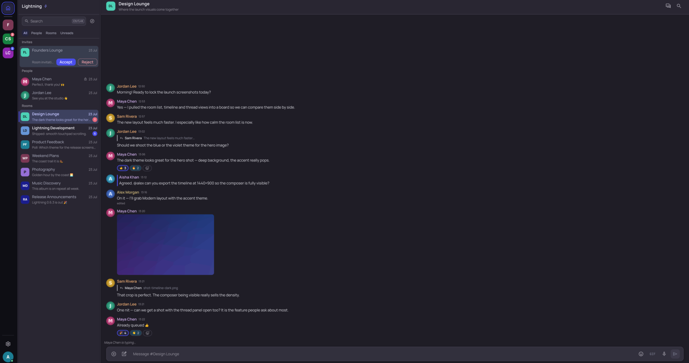
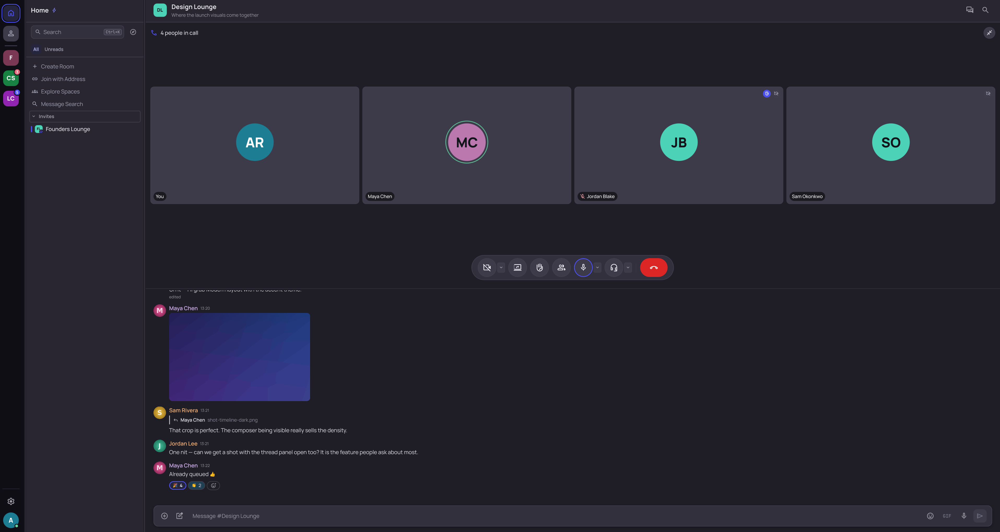
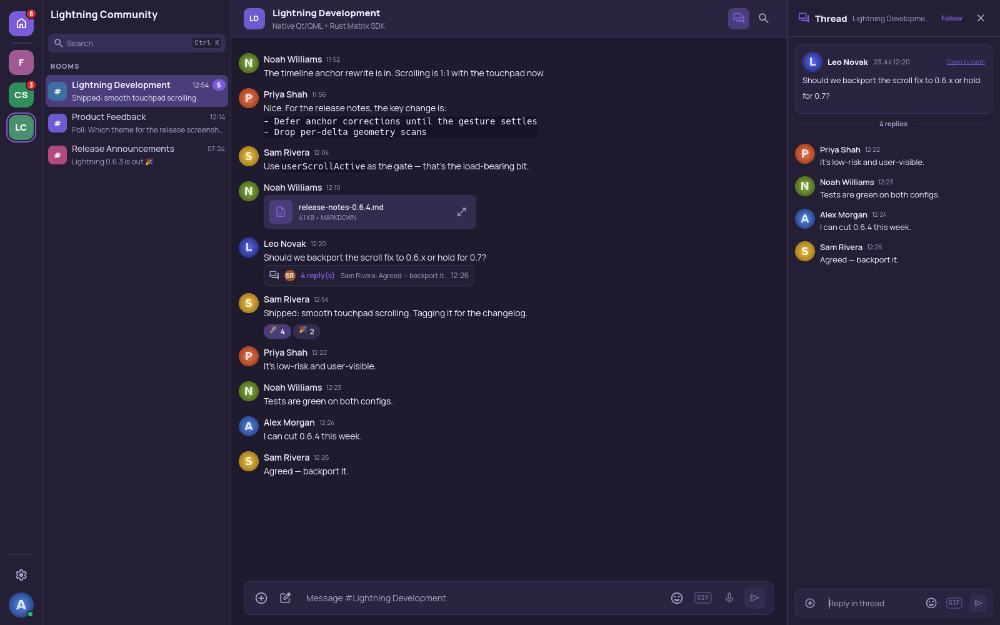
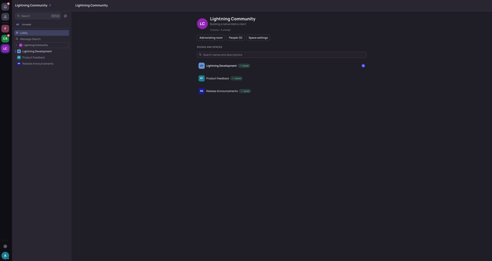
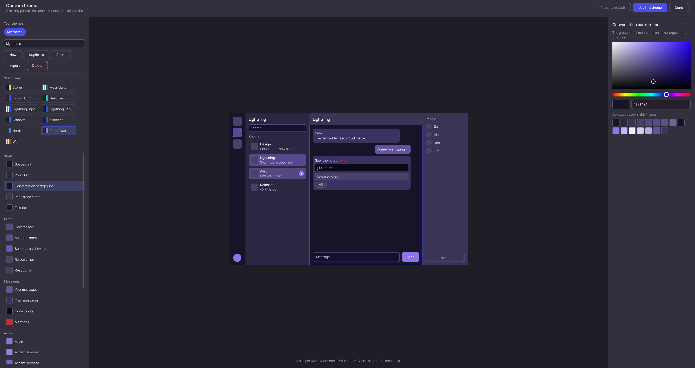

# What Lightning does

A tour of the features, for people deciding whether to try it. The binding,
per-feature contracts that code changes must respect are in
[`feature-contracts.md`](feature-contracts.md); where the two ever disagree,
that file and the source win.

**Messaging.** Live SDK timelines with replies, edits, reactions, redactions,
mentions, typing indicators and read receipts, shown as clickable avatar chips.
Pinned messages, polls (MSC3381), drafts that survive a room switch, and
`@room` where your power level allows. Forward several messages to several
rooms at once and be told which copies failed. Search prefers a local index
kept on your computer, which covers encrypted rooms as well, and offers the
homeserver's search as an explicit choice where the server can read the room;
a coverage line says how many messages are being searched. Received locations,
including live shares, render as a map card.

**Threads.** Real Matrix threads on SDK thread timelines: side panel, per-room
Threads view, summary cards, threaded receipts, follow/unfollow, and text,
image, file and voice replies in encrypted rooms too.

**Calls.** Group calls over MatrixRTC with audio, camera and screen sharing,
interoperating with Element Call: raised hands, per-participant volume,
speaking indication, mute. A share can carry the computer's audio as a
separate encrypted track, at a volume the viewer controls. Resolution and
frame rate are selectable, and the convert-and-scale stage runs on the GPU
where the system supports it. Windows can share a single window. Windows and
macOS packages bundle GStreamer.

**Spaces and navigation.** Two layouts per account: Classic, one
activity-ordered list; or Channels, a Spaces rail with Home, Direct Messages
and one view per Space, with nested subspaces drawn as a tinted tree — or, if
you prefer, turned back into a plain activity-ordered list — drag-to-reorder
and local folders. A Space's front page lists its rooms and subspaces with in-place
editing. Directory browsing, joining by address or `matrix:` URI, knocking,
and role changes, all gated by what Matrix permits.

**Encryption and accounts.** SDK-owned Olm/Megolm with cross-signing, SAS and
QR verification, Secure Backup restore, key import and late in-place
decryption. Sign in with a password or the homeserver's browser flow
(OAuth 2.0 / OIDC), and sign your other devices in from this one with a code
(MSC4108), arriving verified. Optionally refuse unverified devices (MSC4153),
off by default. Per-room display name and avatar. Several accounts on
different homeservers at once, each with an isolated store and its last known
avatar kept on disk so it shows before it syncs; only the active
one syncs.

**Media and the composer.** Images, video and audio with inline playback,
posters and waveforms; encrypted attachments throughout; voice messages
(MSC3245); a two-provider GIF browser (GIPHY and KLIPY) that sends only your
search term; emoji picker; MSC2545 sticker packs with editing; custom emoji
with `:shortcode` completion; a media browser that walks a room's full history
and reports how much it has read; JPEG XL; drag-and-drop. Images open in a
viewer with click-to-zoom, wheel-pan and wrapping navigation, and long media
or link embeds can collapse to a single line. Link previews are
off by default, because Lightning fetches them itself rather than through your
homeserver.

**Moderation and safety.** Mjolnir-style policy lists: read a room's published
ban rules, publish your own where permitted, and follow lists others maintain.
Following a list never blocks anyone by itself. Lightning tells you when
someone is covered by a list you follow, and you decide.

**Desktop.** Eleven WCAG-AA themes plus an editor for your own that grades its
own contrast as you work. Eleven
languages, switchable without a restart, including right-to-left Arabic.
Native notifications with per-room modes written to your account's server push
rules, with reply and mark-as-read from the notification where supported.
Floating always-on-top call window, close-to-tray, quick switcher (Ctrl-K),
rebindable shortcuts, spell checking, imported fonts, and keyboard navigation
throughout. Read receipts can be private or off; typing notices can be off.

**Updates.** Settings, Updates checks for a new release and installs it where
the package format allows. An Ed25519-signed manifest fixes the filename, size
and SHA-256 before anything downloads, and a failed signature or hash is
terminal. Checks are on by default, can be turned off, and send nothing but
`Lightning/<version>`: no Matrix ID, homeserver, device ID, token or tracking
identifier. See [Application updates](updates.md).

## Screenshots

<table>
  <tr>
    <td width="50%">
       
      <b>Classic layout</b> — the conversation list beside a room, with replies, reactions, an image and a pending invite.
    </td>
    <td width="50%">
       
      <b>Calls</b> — a four-person MatrixRTC call: speaking ring, raised hand, muted and camera-off badges, over the room.
    </td>
  </tr>
  <tr>
    <td width="50%">
       
      <b>Threads</b> — a dedicated panel beside the room, with the summary card inline.
    </td>
    <td width="50%">
       
      <b>Channels layout</b> — a Space's own view in the rail, with its lobby and rooms.
    </td>
  </tr>
  <tr>
    <td width="50%">
       
      <b>Theme editor</b> — click any part of the sample window, or a role, to recolour it.
    </td>
    <td width="50%"></td>
  </tr>
</table>

> Every screenshot above comes from Lightning's development-only
> [screenshot-demo mode](screenshot-demo.md): fictional `*.example` accounts,
> drawn avatars and generated pictures, never real conversations. So do the
> README's own picture (`screenshots/readme-hero.png`, 3840x2160, default dark)
> and the store set in `screenshots/flathub/` (Plasma window captures in the
> default light style; see `screenshot-demo.md`, "AppStream / Flathub
> captures").

## Status and known limits

Lightning is listed in the Matrix.org [client
directory](https://matrix.org/ecosystem/clients/) as an **Alpha** client under
GPL-3.0-or-later. That is a directory listing, not an endorsement or
certification.

Worth stating plainly:

- Server-side message search covers **unencrypted rooms only**, because a
  homeserver cannot search ciphertext; encrypted rooms are searched through the
  local index, which holds what this computer has loaded of their history.
- Space-restricted join rules are displayed but not editable.
- Group calls are live-validated against Element on Linux — AppImage, rpm and
  Flatpak — and on a packaged Windows build. The **deb has not been tested**: it
  declares the same GStreamer dependencies as the rpm, so it is expected to
  behave the same way, but that is reasoning rather than a test. **macOS calling
  has not been tested.**
- A first join can occasionally distribute the call's media key before the
  membership list has been read, and the key then reaches nobody; leaving and
  rejoining the call fixes it.
- Windows and macOS packages are **not signed**; the signed update manifest is the
  integrity guarantee on every platform.
- The macOS build has had **no GUI testing on a Mac** and cannot install its own
  updates.

APIs, UI and behaviour may change, some features are experimental, and Matrix
interoperability should be verified rather than assumed.
